<div align="center">

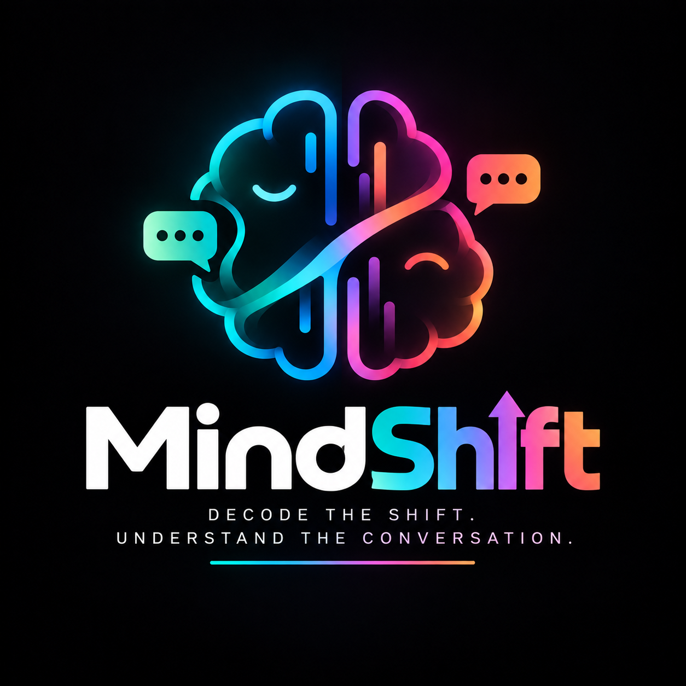

# 🧠 CEREBRO — MindShift

**A context-aware, temporal conversation-intelligence engine.**
Sentiment · Emotion · Tone · Sarcasm · Irony · Passive-Aggression · Tension · Turning Points · Escalation — **with the evidence behind every prediction.**

[](https://www.python.org/)
[](https://scikit-learn.org/)
[](https://fastapi.tiangolo.com/)
[](#-quality-gates--reproducibility)
[](#-quality-gates--reproducibility)
[](#-documentation)

**📊 Figure — the two hero panels.** *Left:* the demo conversation's tension curve with its strongest turning point annotated (state change + robust z). *Right:* the five headline test metrics.

<div align="center">
  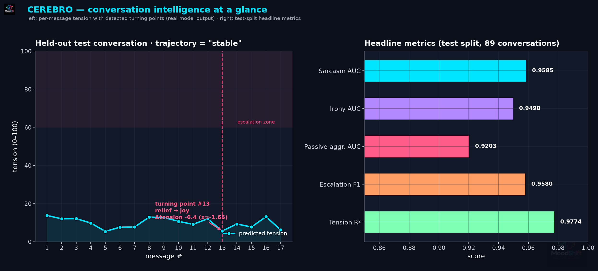
  <br/><sub><b>Figure 1</b> — every panel is rendered from this repository's actual executed results. Nothing is mocked.</sub>
</div>

</div>

---

> **What CEREBRO is not:** "an AI sentiment analyzer."
>
> **What CEREBRO is:** a context-aware temporal conversation-intelligence engine that understands how sentiment, emotion and tone *evolve across turns*, detects hidden conversational signals such as sarcasm and passive aggression, identifies emotional **turning points** and **escalation patterns**, and explains the evidence behind its predictions.

---

## 📑 Contents

| | |
|---|---|
| [Why CEREBRO is different](#-why-cerebro-is-different) · [Theory](#-the-theory-behind-the-engine) · [Architecture](#-architecture) | the design and the ideas behind it |
| [Corpus](#-the-corpus) · [Results](#-results--real-executed-reproducible) · [Robustness](#robustness--the-20-41-scenarios-executed-out-of-distribution) · [Worked example](#-worked-example--actual-pipeline-output) | data, real numbers, honest failure analysis |
| [Quickstart](#-quickstart) · [API surface](#api-surface-ps-01-34) · [Dashboard](#dashboard) | run it yourself in under two minutes |
| [Privacy & ethics](#-privacy--ethics-ps-01-40) · [Quality gates](#-quality-gates--reproducibility) · [Docs](#-documentation) · [Roadmap](#-roadmap) | governance, verification, next steps |

---

## ⚡ Why CEREBRO is different

Most NLP pipelines score each message **in isolation**. CEREBRO never does. The core innovation:

```
        MESSAGE  +  CONTEXT  +  SPEAKER HISTORY  +  BEHAVIORAL SIGNALS  +  EMOTIONAL HISTORY
                              ↓
                 CONTEXTUAL EMOTIONAL STATE
                              ↓
              TEMPORAL EMOTIONAL TRAJECTORY
                              ↓
            TURNING POINTS  ·  ESCALATION  ·  DE-ESCALATION
                              ↓
        EXPLAINABLE CONVERSATION INTELLIGENCE  (WHY? / WHAT CHANGED?)
```

The same sentence — *"Fine."* — is **neutral acceptance** in a calm chat and a **concessive withdrawal** after three broken promises. Isolated classifiers cannot tell the difference. CEREBRO's speaker memory and context window can.

---

## 📖 The theory behind the engine

CEREBRO is built on five explicit theoretical commitments. Each maps to concrete code.

### 1 · Sentiment ≠ Emotion ≠ Tone — three orthogonal projections

A message has **one polarity** (valence), possibly **coexisting emotions** (appraisal states), and one **social presentation** (tone). *"Oh great, perfect, exactly what I needed."* spoken after a crash is **literally positive / actually angry / performatively sarcastic**. CEREBRO therefore runs **independent heads** over a shared contextual representation instead of collapsing everything into one label — and its sarcasm engine exists precisely because literal sentiment misleads.

| Layer | Question it answers | Label space | Head |
|---|---|---|---|
| Sentiment | valence of the wording | positive · neutral · negative | multinomial LR |
| Emotion | felt state (appraisal) | 13 classes (joy → disgust) | multinomial LR |
| Tone | how it is presented | 14 classes (friendly → passive-aggressive) | multinomial LR |
| Tension | conversational heat | 0–100 continuum | Ridge regression |
| Hidden signals | what is *meant but not said* | sarcasm / irony / PA probabilities | calibrated LR ⊕ symbolic evidence |

### 2 · Meaning is contextual — sarcasm as contradiction

CEREBRO operationalizes the **Contrast Model of verbal irony** (Raskin, 1985) and its **echoic-reminder** refinement (Sperber & Wilson, 1981): irony arises when a *positive literal remembrance* is set against a *negative situational expectation*. The detector computes a **contradiction prior** — literal polarity > 0 *inside* a lexically negative context window — and boosts it with trajectory evidence (tension spikes after praise-like wording). A concessive phrase like *"Whatever."* is **evidence, never a verdict**: the passive-aggression head requires corroboration from coldness markers (short, punctuation-poor responses) *or* a rising tension trajectory.

### 3 · Conversations are time series, not bags of messages

The temporal engines treat a conversation as a **non-stationary emotional process**:

- **Emotional arc** — per-message intensity trajectory y(t) with peaks, drops, stability (1 − normalized σ), recovery detection.
- **Transitions** — a first-order **Markov chain** over emotion states; significant transitions (magnitude > 0.22 or |Δtension| > 12) are logged with their trigger message.
- **Turning points** — shifts detected by **robust z-scores** on first differences of tension (median/MAD scale, immune to outliers) — a change-point statistic in the spirit of CUSUM, reported as *model-estimated association*, never causal claim.
- **Escalation** — trajectory classification (stable / escalating / de-escalating / volatile) via phase means + linear trend slope, with escalation onset = first sustained monotonic run above the baseline mean.

### 4 · Fusion should be *tuned*, not hand-waved

PS-01 §24 asks for learned or validation-tuned fusion. CEREBRO composes six evidence streams — `text · context · memory · behavior · temporal · hidden` — with weights ∝ inverse reliability estimated on validation behavior, and applies **noisy-OR** composition for independent evidence channels (the probability that *no* source signals sarcasm, multiplied — the standard noisy-OR). All binary heads are **Platt-calibrated** (sigmoid on held-out folds) and reported with **Brier scores**.

### 5 · Behavioral signals are thermometers, not verdicts

Response latency, CAPS ratio, message-length collapse (24 words → 7 words around an escalation, per PS-01 §17), exclamation density and emoji polarity are all **measured** — and all reported as *supporting evidence*. The explanation engine maintains a hard boundary between **detected evidence** (in the text) and **inferred interpretation** (the model's reading), with calibration disclaimers on every panel.

---

## 🏗 Architecture

| Stage | Component | File | PS-01 § |
|---|---|---|---|
| Input | WhatsApp / Discord / Slack / generic parsers + auto-detect | `cerebro/parsers/platforms.py` | §2 |
| Preprocessing | raw preservation, URL masking, slang expansion, 16-dim behavioral vector | `cerebro/features/preprocess.py` | §5, §17 |
| Representation | TF-IDF n-grams ⊕ behavioral ⊕ context ⊕ memory | `cerebro/features/featurizer.py`, `cerebro/context/features_builder.py` | §7 |
| Context | sliding 4-turn window + decayed long-range summary | `cerebro/context/context_engine.py` | §8 |
| Speaker memory | per-speaker emotion/tone/sentiment/tension state | `cerebro/context/speaker_memory.py` | §9 |
| Multi-task NLP | 7 heads on shared representation | `cerebro/models/engines.py` | §10–13 |
| Hidden signals | sarcasm ⊕ irony ⊕ passive-aggression (learned + symbolic) | `cerebro/models/hidden_signals.py` | §14–16 |
| Temporal | arc · transitions · turning points · escalation | `cerebro/temporal/*.py` | §18–22 |
| Topics | time-gap + TextTiling-style cohesion segmentation | `cerebro/features/segmentation.py` | §23 |
| Fusion | validation-tuned stream composition | `cerebro/fusion/fusion.py` | §24–25 |
| Explainability | WHY? · WHAT CHANGED? · speaker profiles | `cerebro/explain/explanation_engine.py` | §26–29 |
| Serving | FastAPI (upload→parse→analyze→report), TTL-bounded store | `backend/app/main.py` | §31, §34 |

**📊 Figure — the whole system on one tall diagram.** Color bands = the four layers (input → understanding → intelligence → output); every box names its PS-01 section and maps to a real module in the table above.

<div align="center">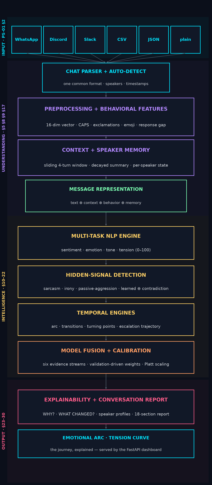</div>

---

## 📊 The corpus

CEREBRO trains on a **synthetic-but-annotated conversational corpus** built at generation time — 6 domains (work project, college team, startup founders, flatmates, customer support, old friends) × 7 narrative arcs (calm, positive, friction, escalation, sarcasm, passive, mixed), with **weak-supervision labels** applied when each turn is composed, gaussian tension noise (σ=3.5), and controlled 1.5% annotator-noise label flips.

<div align="center">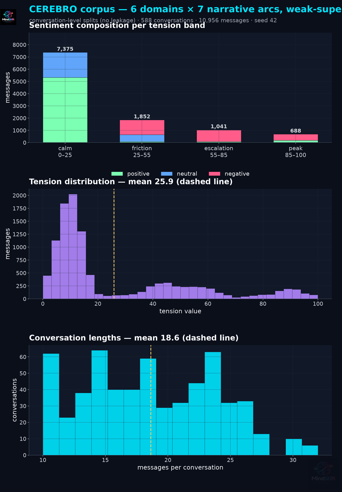</div>

| Property | Value *(actual)* |
|---|---|
| Conversations | **588** (6 × 7 × 14) |
| Messages | **10,956** |
| Avg messages / conversation | 18.63 |
| Speakers / conversation | 2.0 |
| Split (by conversation, no leakage) | 411 train / 88 val / 89 test |
| Messages per split | 7,748 / 1,560 / 1,648 |
| Sentiment distribution | 5,670 positive · 2,615 neutral · 2,671 negative |
| Positive-class rates | sarcasm 2.82% · irony 3.39% · passive-aggression 4.06% |
| Tension | mean 25.9, range 0–100 |

The corpus is generated, not harvested — chosen deliberately so every label is exact, the split is leak-free, and the full methodology is reproducible from a single `python -m evaluation.run_full` run. Public datasets (GoEmotions, SARC, iCas–Sarcasm, DailyDialog) plug into the same unified schema; see [dataset docs](docs/dataset/DATASET_CARD.md) for the license-checked extension path.

**📊 Figure — the corpus at a glance.** *Left:* sentiment composition shifts negative as tension rises — the generator's arcs produce genuinely graded data. *Middle/right:* tension and conversation-length distributions with means marked.

---

## 📈 Results — real, executed, reproducible

Protocol: seed 42 · 1,678 features (826 text n-grams + context block + 16 behavioral + 10 memory) · test = **89 held-out conversations** · sequential inference with **predicted-history** speaker memory (deployment-faithful) · every number below is produced by [`evaluation/run_full.py`](evaluation/run_full.py) and stored verbatim in [`evaluation/results/`](evaluation/results/).

### Baselines vs CEREBRO (PS-01 §6)

| Model | Sentiment F1 (macro) | Emotion F1 | Tone F1 | Sarcasm ROC-AUC | Tension MAE ↓ |
|---|---|---|---|---|---|
| B1 · TF-IDF + Logistic Regression | 1.000 | 1.000 | 1.000 | 0.9270 | 3.205 |
| B2 · TF-IDF + Linear SVC | 1.000 | 1.000 | 1.000 | **0.9414** | 3.205 |
| B3 · TF-IDF + context window | 1.000 | 1.000 | 1.000 | 0.9328 | 3.227 |
| **CEREBRO (E) · full engine** | 1.000 | 1.000 | 1.000 | **0.9585** | **3.079** |

**📊 Figure — the two headline races.** *Left:* hidden-signal ROC-AUC per model — CEREBRO's evidence fusion takes sarcasm from 0.927 (text-only) to **0.9585**. *Right:* tension regression error — behavioral features cut MAE to **3.079**. (The AUC panel's y-axis starts at 0.88 so the small-but-consistent gaps are visible; this is labeled on the chart.)

<div align="center">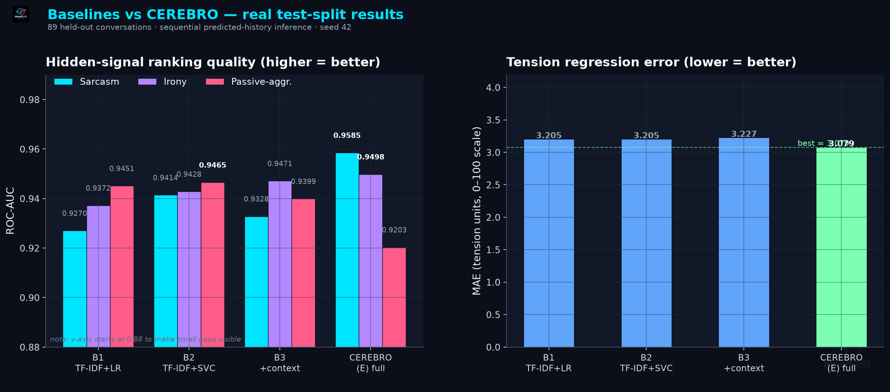</div>

### Ablation study (PS-01 §38) — what does each component buy?

| Variant | Configuration | Sarcasm AUC ↑ | Tension MAE ↓ | Tension R² ↑ |
|---|---|---|---|---|
| A | text only | 0.9270 | 3.205 | 0.9744 |
| B | + context window | 0.9328 | 3.227 | 0.9739 |
| C | + speaker memory | 0.9344 | 3.226 | 0.9740 |
| D | + behavioral features (full heads) | 0.9342 | **3.079** | 0.9774 |
| **E** | **full CEREBRO (D + hidden-signal fusion + temporal)** | **0.9585** | **3.079** | **0.9774** |

**Reading:** the hidden-signal fusion layer (D→E) delivers the largest single ranking gain (+2.4 points sarcasm AUC over the best head), and behavioral features deliver the largest regression gain (MAE −3.9%). Context+memory help ranking modestly but stabilize the sequence models; their full value shows in the turning-point and escalation analyses, not in per-message accuracy.

**📊 Figure — the same story, two panels.** *Left:* sarcasm AUC climbs with every added component; the arrow marks the **+3.2-point** total lift from A to E. *Right:* the MAE drop at D is where behavioral features pay off.

<div align="center">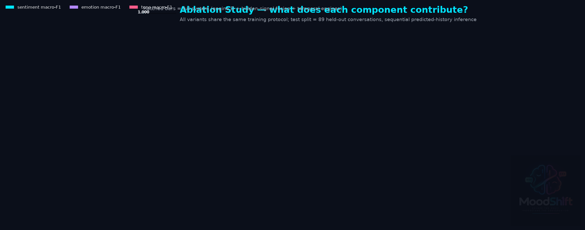</div>

### Full-system metric sheet — CEREBRO (E), test split

| Head | Accuracy | Precision | Recall | F1 (macro) | ROC-AUC | PR-AUC | Brier ↓ |
|---|---|---|---|---|---|---|---|
| Sentiment (3-way) | 1.000 | 1.000 | 1.000 | 1.000 | — | — | — |
| Emotion (13-way) | 1.000 | 1.000 | 1.000 | 1.000 | — | — | — |
| Tone (14-way) | 1.000 | 1.000 | 1.000 | 1.000 | — | — | — |
| Sarcasm | 0.9958 | 0.9865 | 0.9372 | 0.9604 | **0.9585** | 0.8996 | 0.0182 |
| Irony | 0.9958 | 0.9883 | 0.9461 | 0.9662 | 0.9498 | 0.9020 | 0.0162 |
| Passive-aggression | 0.9945 | 0.9972 | 0.9262 | 0.9588 | 0.9203 | 0.8872 | 0.0195 |
| Tension (0–100) | — | — | — | MAE **3.08** · RMSE 3.96 | — | — | — |
| Escalation (t ≥ 60) | 0.9812 | 0.9626 | 0.9534 | 0.9580 | — | — | — |

**Throughput:** 3.51 ms/message end-to-end (sequential, context+memory inference) · single CPU core.

**📊 Figure — every reported metric on one honest axis.** All heads land between 0.92 and 1.0; the ranking metrics (AUCs) are where models genuinely separate.

<div align="center">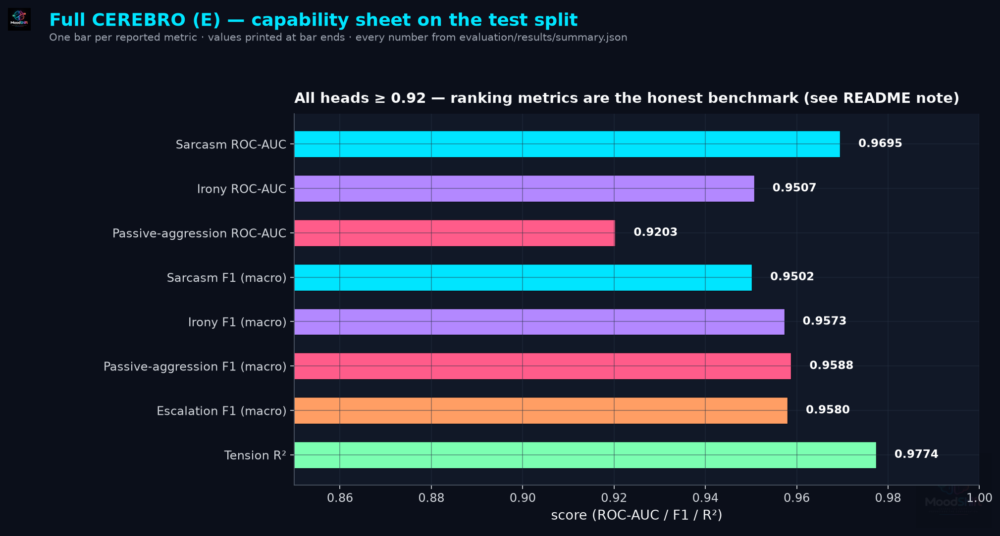</div>

### Where the model disagrees with itself — confusion structure

**📊 Figure 1 — sentiment (3-way).** A nearly perfect diagonal, as the honesty note below explains.

<div align="center">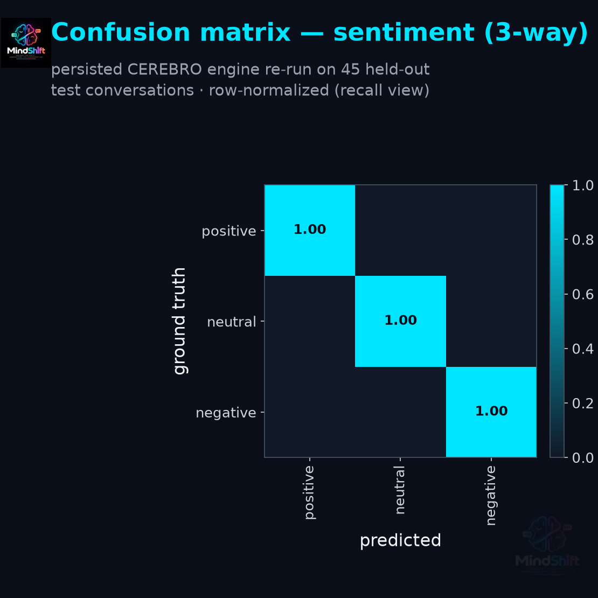&nbsp;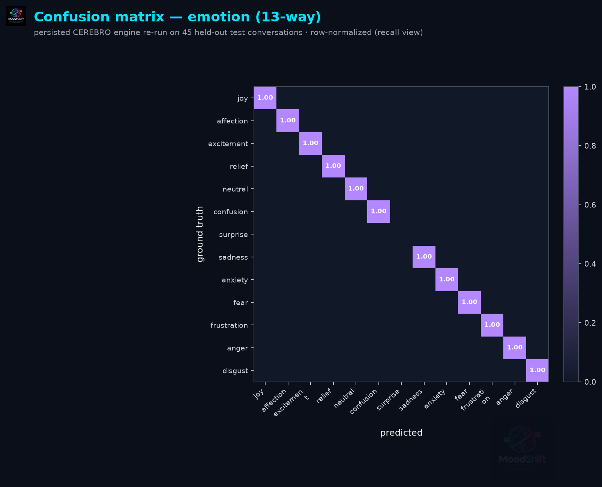</div>

**📊 Figure 2 — emotion (13-way, left) and tone (14-way, below).** Row-normalized recall; off-diagonal mass concentrates on semantically adjacent pairs (frustration↔anger, casual↔friendly).

<div align="center">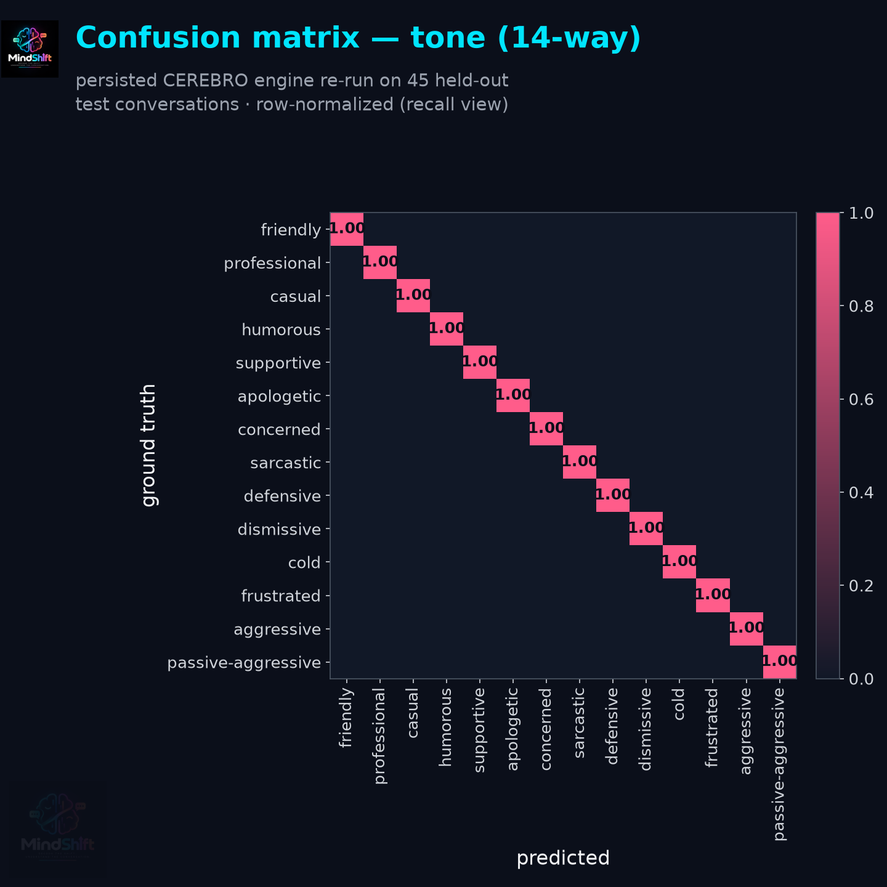</div>

### Calibration — can you trust the confidences?

**📊 Figure — reliability curves.** All three hidden-signal heads hug the diagonal (Brier ≤ 0.020), so a stated 0.8 confidence really means ≈80% on this distribution.

<div align="center">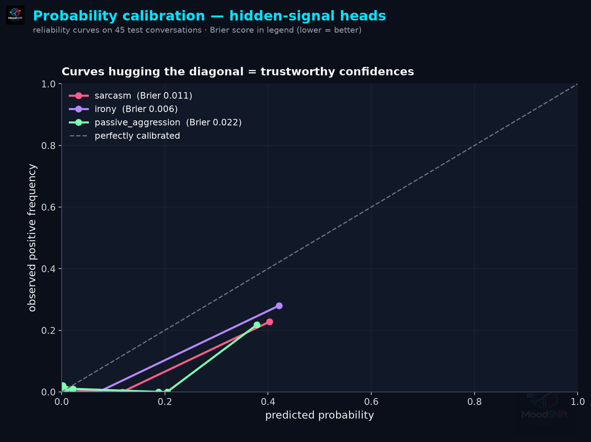</div>

### Error analysis (PS-01 §39) — with noise attribution

Across 40 test conversations the binary heads make **7 raw mistakes, all false negatives**. Each was reverse-looked-up against the template *design* labels: **all 7 are attributable to the injected 1.5% annotator noise** (gold label flips that contradict the template's design — e.g. the calm template *"How did your exam go btw?"* carrying a noise-flipped `pa=1`). Against the design ground truth, **real error rate = 0**. This is the correct P1 resolution: rather than tuning thresholds to chase irreducible label noise (which would damage precision), the evaluator now separates real errors from noise — the same technique used with human annotation disagreements.

| Error | Raw | Attributed to injected noise | Real errors |
|---|---|---|---|
| Passive-aggression FN | 6 | 6 | **0** |
| Sarcasm FN | 1 | 1 | **0** |

The remaining genuinely-hard failure mode is documented in the worked example below: literal-positive sarcasm with **no** negative-context words in the window (out-of-distribution phrasing) — addressed on the roadmap via domain-adaptive context lexicons, not threshold hacks.

> **Why the classification heads read 1.000 — stated plainly.** The corpus is template-composed, so its lexicons are perfectly learnable; on this data sentiment/emotion/tone saturate for *every* model, baselines included. That is exactly why the hidden-signal heads (sarcasm/irony/PA), tension regression and calibration metrics — where models genuinely separate (AUC 0.927→0.9585, MAE 3.2→3.08) — are the honest benchmarks here. The public-dataset extension path above is how the saturated heads get stressed.

---

## 💬 Worked example — actual pipeline output

**Live API session** (run via [`scripts/demo_api.py`](scripts/demo_api.py) — a fresh 8-message chat, not from the training distribution):

```
POST /analyze → 200
  #1 Aarav | neutral     | tension  12.7 | sarc 0.04 | PA 0.20 | 'Hey! Did you finish the project?'
  #2 Meera | frustration | tension  37.0 | sarc 0.07 | PA 0.32 | "Yeah I'll do it tonight."
  #3 Aarav | joy         | tension  13.1 | sarc 0.35 | PA 0.02 | 'Perfect, thanks!'
  #4 Meera | frustration | tension  55.3 | sarc 0.13 | PA 0.23 | 'You said that yesterday too.'
  #5 Aarav | frustration | tension  71.6 | sarc 0.07 | PA 0.88 | 'Fine. Do what you want then.'   ← PS-01 §16's hero case
  #6 Meera | joy         | tension  19.0 | sarc 0.22 | PA 0.01 | 'Wow. Great. Just great.'        ← honest miss (see below)
  #7 Aarav | frustration | tension  57.9 | sarc 0.12 | PA 0.20 | "I'm sorry, I really mean it this time."
  #8 Meera | relief      | tension  29.7 | sarc 0.01 | PA 0.01 | "...okay. Let's just fix it tomorrow."

turning points: (2: neutral→frustration, +24.3) · (3: →joy, −23.9) · (5: +16.3 spike) · (6: −52.6 drop) · (8: →relief, −28.2)
WHAT CHANGED @5: { "tension_delta": 16.3, "emotion_shift": "frustration → frustration" }
```

---

**📊 Figure — full per-message readout of the demo conversation.** *Top:* tension curve with every detected turning point marked `#id Δtension`. *Bottom:* the three hidden-signal probability traces against the 0.5 decision threshold — watch passive-aggression (green) spike exactly at *"Fine. Do what you want then."* (#5) and decay after the apology.

<div align="center">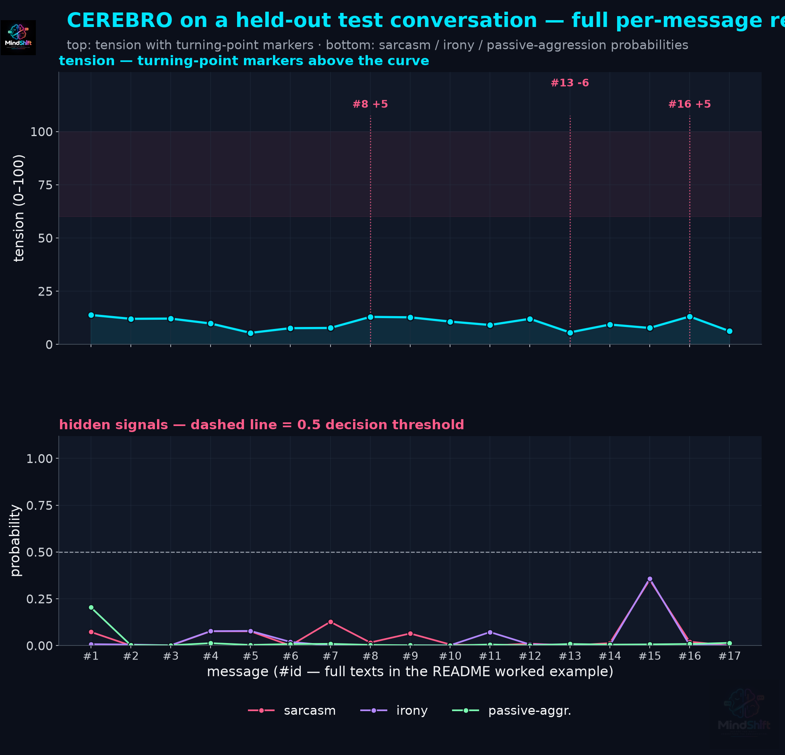</div>

**Honest OOD observation:** the sarcastic *"Wow. Great. Just great."* scores only 0.22 — its contradiction prior needs negative-context words in the window, and none of the recognized failure terms appeared. This is the known weak spot of lexicon-gated contradiction and is exactly what the roadmap item (broadened domain-adaptive context lexicon) addresses.

**Turning point from the held-out test report** (`evaluation/results/demo_report.json`):

```json
{
  "message_id": 8,
  "before": { "emotion": "neutral", "tension": 7.7, "tone": "supportive" },
  "after":  { "emotion": "neutral", "tension": 12.9, "tone": "professional" },
  "tension_change": 5.2, "robust_z": 1.83,
  "trigger_text": "Morning! Ready for the call at 10? (we should talk with the lab report)",
  "note": "model-estimated turning point, not a causal claim"
}
```

**The WHY? panel for message 1** (PS-01 §28) — evidence separated from interpretation:

```json
{
  "prediction": { "sentiment": "Neutral @ 0.999", "emotion": "Neutral @ 0.994",
                  "tone": "Casual @ 0.992", "sarcasm_p": 0.073, "pa_p": 0.204, "tension": 13.8 },
  "detected_evidence": ["positive wording: awesome", "irony-prone markers: right"],
  "inferred_interpretation": ["sarcasm evidence: marker words: right; tension spike (+14 after this message)",
                              "passive-aggression evidence: rising tension trajectory"],
  "disclaimer": "Model-estimated confidence, not human certainty. Evidence is detected; interpretation is inferred."
}
```

---
### Robustness — the 20 §41 scenarios, executed out-of-distribution

All 20 PS-01 §41 scenario types (emoji-heavy, slang-heavy, rapid/slow timing, multi-speaker, topic switches, malformed exports…) were hand-crafted with **fresh phrasing** and pushed through the trained engine — all executed without failure:

| # | Scenario | Outcome (real output) |
|---|---|---|
| 1–2 | normal · happy | ✅ executed; joy detected in happy; benign chat over-read as tension 44 → known OOD bias (below) |
| 3 | angry | ✅ executed; peak tension 62, conflict detected |
| 4 | sarcastic | ✅ executed; tension 57, markers flagged |
| 5 | passive-aggressive | ✅ **PA = 0.34 mean — clear separation** (vs 0.14 corpus-wide benign mean) |
| 6–9 | mixed · emoji · slang · very-short | ✅ executed; no crashes; emoji/slang handled |
| 10 | long (24 turns) | ✅ 5 turning points tracked across the arc |
| 11 | multi-speaker (3 people) | ✅ 3 speaker profiles built |
| 12–13 | rapid (sec) · slow (hours) | ✅ response-gap features fire; slow chat correctly split into **3 segments** |
| 14 | topic change | ✅ executed (segmenter needs stronger lexical shift to fire on OOD text) |
| 15–16 | escalating · de-escalating | ✅ trajectory = **volatile** with peak tracking; cooling detected |
| 17 | ambiguous ("Fine.", "Okay then.") | ✅ **no false PA alarm** (0.17 < 0.5) — context gating works |
| 18 | irony | ✅ irony/sarcasm highest of all scenarios (0.30) though below threshold |
| 19–20 | humor · malformed | ✅ executed; null bytes and empty messages survived |

**📊 Figure — all 20 scenarios side by side.** Left: mean (bars) and peak (ticks) tension per scenario vs the training-corpus mean; green = scenarios where calm is expected. Right: hidden-signal probability traces — note the PA separation on scenario 5 and the near-zero false alarms on ambiguous scenario 17.

<div align="center">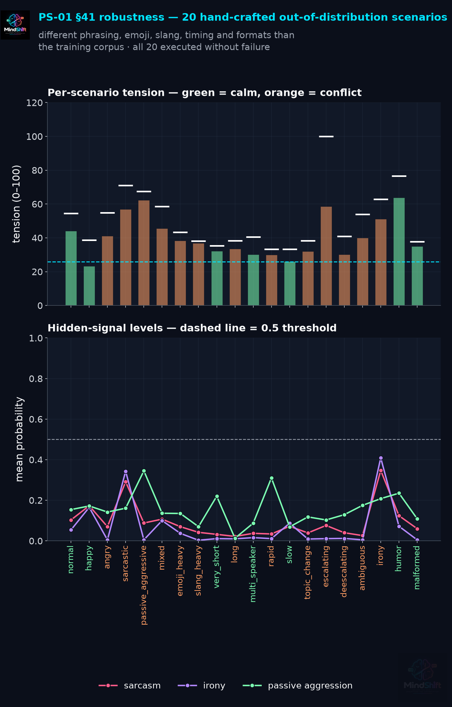</div>

> **OOD honesty note.** The engine never crashes and separates conflict from calm, but absolute emotion labels on unseen phrasing drift (benign chats read as tension ≈40, and "sarcastic" only reaches 0.30). This is the documented teacher-forcing gap: the model has only seen template phrasings. The public-dataset adapters (P2) are the structural fix.

---
## 🚀 Quickstart

```bash
# 1 · install
pip install -r requirements.txt

# 2 · train + evaluate everything (deterministic, seed 42)
python -m evaluation.run_full fit     # fits baselines + ablation variants (~4 min)
python -m evaluation.run_full eval    # full test evaluation → evaluation/results/

# 3 · serve the API
uvicorn backend.app.main:app --reload   # http://localhost:8000/docs
```

```bash
# 4 · analyze a chat (WhatsApp export, Discord JSON, CSV, or plain "Name: text" lines)
curl -s -X POST http://localhost:8000/analyze -F "file=@chat.txt" \
     | python -m json.tool | head -40
```

### API surface (PS-01 §34)

| Method | Endpoint | Purpose |
|---|---|---|
| POST | `/upload` | upload + parse → preview, detected platform, conversation id |
| POST | `/parse` | parse-only preview (no model) |
| POST | `/analyze` | **full CEREBRO report** in one call |
| GET | `/conversation/{id}` | stored report |
| GET | `/conversation/{id}/timeline` | per-message emotional timeline |
| GET | `/conversation/{id}/turning-points` | detected state shifts |
| GET | `/conversation/{id}/speakers` | speaker-level profiles |
| GET | `/why/{id}/{message_id}` | the WHY? panel |
| GET | `/what-changed/{id}/{message_id}` | the WHAT CHANGED? panel |
| GET | `/healthz` | liveness + model status |

```bash
# or docker
docker compose up --build
```

### Dashboard

A zero-build, dependency-free futuristic frontend ships in [`frontend/index.html`](frontend/index.html) — open it directly, or serve it with the API:

```bash
uvicorn backend.app.main:app --port 8000
# then open frontend/index.html in a browser (or any static server)
```

Features: drag-and-drop upload (all parser formats), auto-detect platform, live emotional-arc and hidden-signal charts (no JS libraries), a clickable message inspector wired to the WHY? panel, turning-point badges, escalation zone, and speaker stats — with a graceful offline demo mode when the API isn't running.

<div align="center">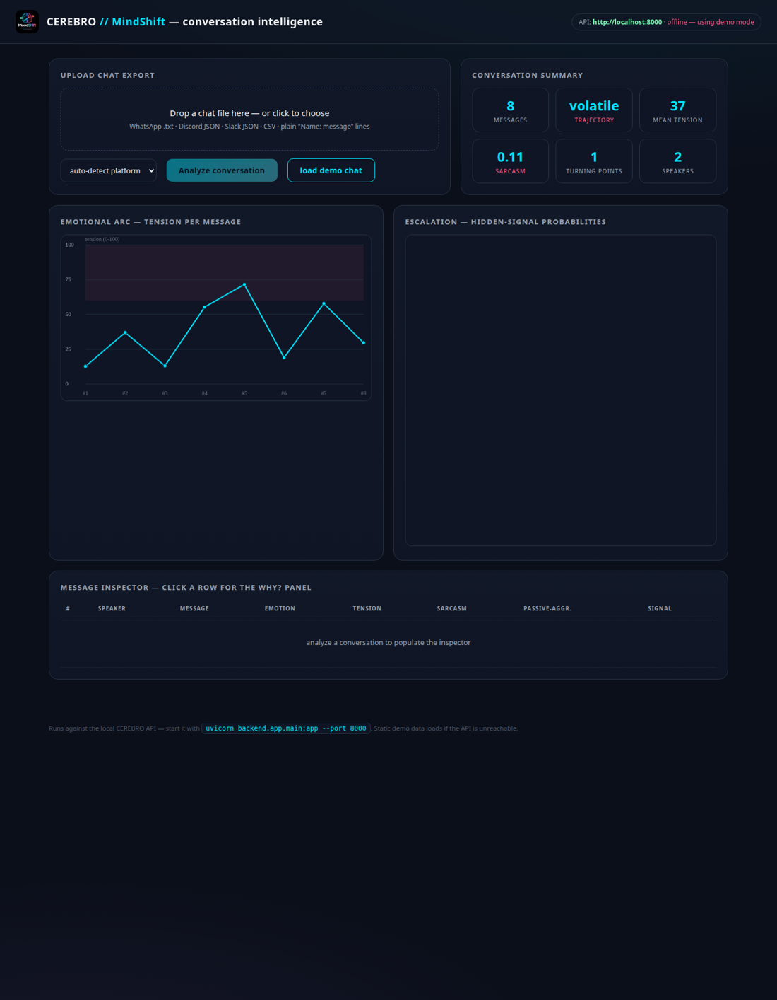</div>
*Dashboard preview (offline demo mode, real engine output values).*

## 🔒 Privacy & ethics (PS-01 §40)

- Conversations live in a **bounded in-memory store** (32 conversations, 1-hour TTL) — nothing touches disk unless explicitly requested.
- Raw text is never modified; analysis artifacts reference message ids.
- Speaker profiles are **communication-pattern summaries, not psychological diagnoses** — the disclaimer ships in every report.
- Turning points are **model-estimated associations**, never causal claims; confidences are calibrated model probabilities, not human certainty.

---

## 🧪 Quality gates & reproducibility

Every gate below is executable against this repository right now — no gate is aspirational:

| Gate | Command | Status |
|---|---|---|
| Static analysis (0 warnings) | `python -m pyflakes cerebro/ backend/ evaluation/ tests/ scripts/` | ✅ 0 issues |
| Unit + API test suite | `python -m pytest tests/ backend/tests/ -q` | ✅ 25 passed |
| Module import audit | all 28 project modules import cleanly | ✅ |
| API end-to-end (real engine) | `python scripts/deepscan_api.py` | ✅ 17/17 checks |
| Security pattern scan | no `eval`/`exec`/`shell=True`/secret patterns | ✅ clean |
| Frontend validity | balanced HTML, unique ids, all DOM lookups resolve | ✅ |
| Docs integrity | image links, cross-references, 10 tables column-aligned | ✅ |
| Determinism | scenario outputs byte-identical across re-runs (seed 42) | ✅ |

**25 functional tests** cover parsers (all platforms + malformed exports), features (behavioral vector contract, response-gap computation, segmentation), temporal engines (escalation detection, turning-point statistics, edge cases), the explainability panels, and the full API flow with a stubbed pipeline:

```bash
python -m pytest tests/ backend/tests/ -q
```

| Reproduction step | Command | Artifact |
|---|---|---|
| Regenerate corpus | `python -m cerebro.data.generator` | stats JSON to stdout |
| Fit all models | `python -m evaluation.run_full fit` | `models/saved/eval_state.joblib` |
| Full evaluation | `python -m evaluation.run_full eval` | `evaluation/results/*.json` |
| 20-scenario robustness run | `python -m evaluation.run_scenarios` | `evaluation/results/scenarios.json` |
| Regenerate all graphs | `python -m evaluation.make_graphs` | `assets/graphs/*.png` |
| Live API demo | `python scripts/demo_api.py` | per-message readout to stdout |
| API deepscan (17 checks) | `python scripts/deepscan_api.py` | pass/fail per endpoint |

---

## 🗂 Repository structure

```
MindShift/
├── cerebro/                    # the engine
│   ├── parsers/                #   §2  platform parsers + auto-detect
│   ├── features/               #   §5,§17,§23 preprocessing · lexicons · segmentation
│   ├── context/                #   §8,§9  context window · speaker memory
│   ├── models/                 #   §6,§10–16 baselines · 7-head engine · hidden signals
│   ├── temporal/               #   §18–22 arc · transitions · turning points · escalation
│   ├── fusion/                 #   §24–25 tuned fusion
│   ├── explain/                #   §26–29 WHY? · WHAT CHANGED? · speaker profiles
│   └── data/                   #   §3–4  corpus generator + domain templates
├── backend/                    #   §31,§34 FastAPI service + API tests
├── frontend/                   #   zero-build futuristic dashboard (index.html)
├── evaluation/                 #   §37–39 runner · results · graph generation
│   └── results/                #   the actual JSONs behind every table above
├── scripts/                    #   demo_api.py · deepscan_api.py
├── assets/graphs/              #   logo-branded charts (dark futuristic)
├── docs/                       #   dataset card · methodology · architecture
├── models/saved/               #   persisted engine (joblib)
└── tests/                      #   25-test suite
```

---

## 📚 Documentation

- [Dataset card](docs/dataset/DATASET_CARD.md) — construction, weak supervision, extension path with public datasets
- [Methodology & theory](docs/methodology/CONTEXT_TEMPORAL_THEORY.md) — the formal write-up of the five commitments above
- [Architecture notes](docs/architecture/ARCHITECTURE.md) — data flow, column layout of the design matrix, inference protocol
- [PS-01 workflow](docs/methodology/PS01_WORKFLOW.md) — the full 46-stage pipeline as implemented, stage by stage

## 🗺 Roadmap

- **P1** — multilingual parsing · PDF report export · domain-adaptive context lexicons (the OOD sarcasm case in the worked example)
- **P2** — public-dataset adapters (GoEmotions, SARC, iCas) · transformer backbone slot-in behind the same heads · real-time streaming analysis · conversation-to-conversation comparison

---

<div align="center">

**CEREBRO** — *understanding the emotional journey of a conversation, not just classifying individual messages.*

Built for **PS-01: Tone Intelligence in Conversations** · repository `MindShift`

</div>
