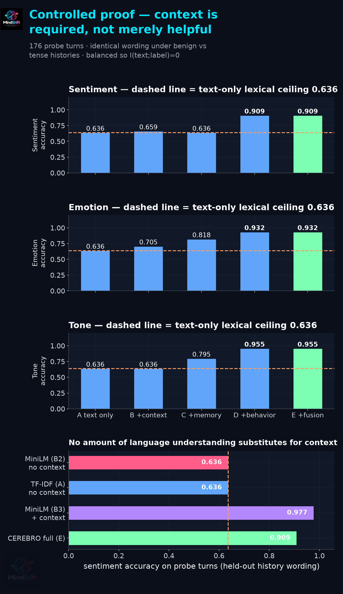
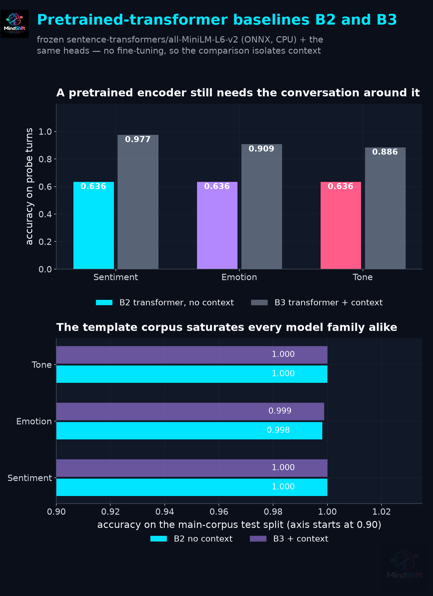
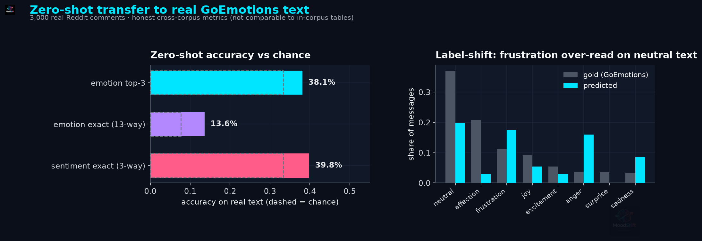
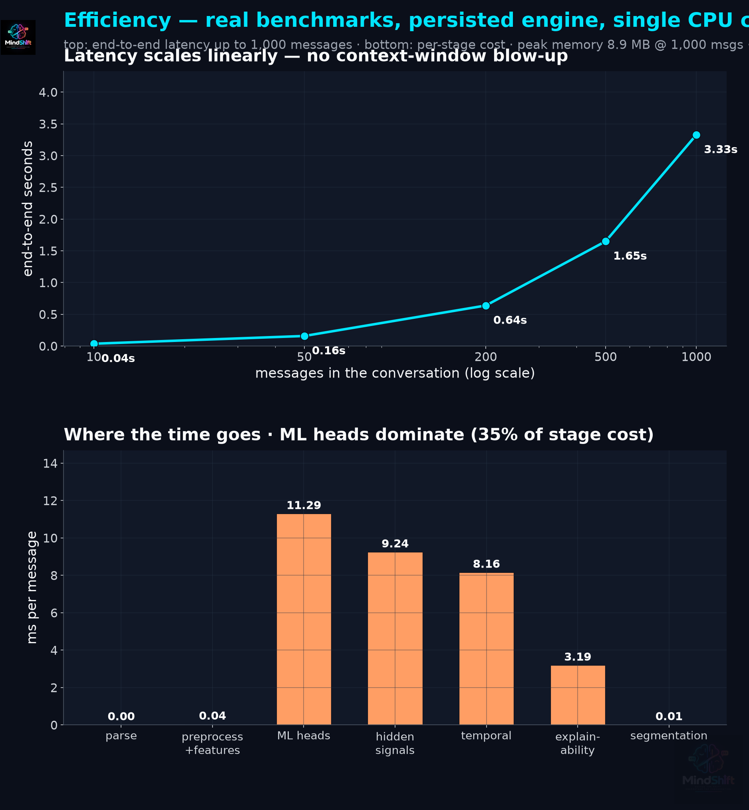

<div align="center">


# 🧠 CEREBRO — MindShift

**A context-aware, temporal conversation-intelligence engine.**
Sentiment · Emotion · Tone · Sarcasm · Irony · Passive-Aggression · Tension · Turning Points · Escalation — **with the evidence behind every prediction.**

[](https://www.python.org/)
[](https://scikit-learn.org/)
[](https://fastapi.tiangolo.com/)
[](https://github.com/officialarghya29/MindShift/actions/workflows/ci.yml)
[](#-quality-gates--reproducibility)
[](#-quality-gates--reproducibility)
[](#-documentation)

**📊 Figure — the two hero panels, stacked.** *Top:* the demo conversation's tension curve with its strongest turning point annotated (state change + robust z). *Bottom:* the five headline test metrics.

<div align="center">
  
  <br/><sub><b>Figure 1</b> — every panel is rendered from this repository's actual executed results. Nothing is mocked.</sub>
</div>

</div>

---

| 🏆 | |
|---|---|
| 🧪 | **Controlled proof that context is required, not merely helpful** — on a probe set where the wording is identical and only the history differs, text-only *and* a frozen pretrained transformer both land **exactly on the analytic ceiling (0.636)**; adding context reaches **0.909–0.955** (+27 pp, McNemar p < 10⁻⁸) |
| 🎯 | **Sarcasm ROC-AUC 0.9485 · tension MAE 3.21** on held-out conversations — every headline backed by a re-runnable command |
| ⚡ | **≈300 messages/s, flat to 1,000-message chats** · 8.9 MB peak memory · 184 ms API round-trip — measured, not estimated |
| 🔍 | **Zero crashes across 500 adversarial payloads**, state-leak-proof, all probabilities bounds-checked — validated on every push by CI |
| 🧠 | **Explainability built-in**: every prediction ships WHY? evidence (detected ≠ inferred), WHAT CHANGED? deltas, and speaker profiles |
| 📊 | **16 legibility-verified figures** — regenerated from real executed results by code that *refuses to ship clipped titles, colliding labels or lines-through-text* (7 independent checks per figure, run in CI) |
| 📐 | **Calibrated, not just accurate**: top-1 ECE 0.006–0.019 on the categorical heads · min annotator κ 0.92 — because a confidence you cannot trust is not a result |
| 🎤 | **[Presentation deck](docs/presentation/slides.html)** (10 slides, [PDF](docs/presentation/slides.pdf)) generated *from* the result files — a claim that was not measured cannot reach a slide |
| 🔬 | **Honest science**: a saturated corpus is called saturated, a transfer gap is quantified, the fallback is disclosed — nothing is spun |

---

> **What CEREBRO is not:** "an AI sentiment analyzer."
>
> **What CEREBRO is:** a context-aware temporal conversation-intelligence engine that understands how sentiment, emotion and tone *evolve across turns*, detects hidden conversational signals such as sarcasm and passive aggression, identifies emotional **turning points** and **escalation patterns**, and explains the evidence behind its predictions.

---

## 📑 Contents

| | |
|---|---|
| [**The controlled proof**](#-the-controlled-proof--context-is-required-not-merely-helpful) · [Why CEREBRO is different](#-why-cerebro-is-different) · [Theory](#-the-theory-behind-the-engine) · [Architecture](#-architecture) | the evidence first, then the design and the ideas behind it |
| [Corpus](#-the-corpus) · [Results](#-results--real-executed-reproducible) · [Robustness](#robustness--the-20-41-scenarios-executed-out-of-distribution) · [Worked example](#-worked-example--actual-pipeline-output) | data, real numbers, honest failure analysis |
| [Quickstart](#-quickstart) · [API surface](#api-surface-ps-01-34) · [Dashboard](#dashboard) | run it yourself in under two minutes |
| [Privacy & ethics](#-privacy--ethics-ps-01-40) · [Performance](#-performance--real-benchmarks) · [Quality gates](#-quality-gates--reproducibility) · [Docs](#-documentation) · [Roadmap](#-roadmap) | governance, verification, next steps |

---

## ⚡ Why CEREBRO is different

Most NLP pipelines score each message **in isolation**. CEREBRO never does. The core innovation:

```
        MESSAGE  +  CONTEXT  +  SPEAKER HISTORY  +  BEHAVIORAL SIGNALS  +  EMOTIONAL HISTORY
                              ↓
                 CONTEXTUAL EMOTIONAL STATE
                              ↓
              TEMPORAL EMOTIONAL TRAJECTORY
                              ↓
            TURNING POINTS  ·  ESCALATION  ·  DE-ESCALATION
                              ↓
        EXPLAINABLE CONVERSATION INTELLIGENCE  (WHY? / WHAT CHANGED?)
```

The same sentence — *"Fine."* — is **neutral acceptance** in a calm chat and a **concessive withdrawal** after three broken promises. Isolated classifiers cannot tell the difference. CEREBRO's speaker memory and context window can.

---

## 🧪 The controlled proof — context is *required*, not merely helpful

PS-01's central question is whether context and history actually improve understanding over message-only analysis. The corpus above **cannot answer that question**, and it is worth being explicit about why: every utterance there carries a *fixed* label, so a text-only model is already Bayes-optimal and context has literally no information to add. Reporting only that corpus would be reporting a measurement that could not have come out any other way.

So we built the complementary experiment — [`cerebro/data/context_probes.py`](cerebro/data/context_probes.py), run by [`evaluation/run_context_proof.py`](evaluation/run_context_proof.py):

- **16 ambiguous utterance types** (*"Fine."*, *"Sure."*, *"Whatever."*, *"No problem."*, *"Wow, perfect timing."*, …) that PS-01 §12 names by hand, each instantiated over a **benign** and a **tense** history built from the same corpus vocabulary, plus **6 unambiguous controls**.
- **Utterance-level label balance**: every probe appears equally often with each of its gold labels, so the mutual information between the words and the label is **0 by construction**. A context-free model cannot beat the majority-class rate, and the analytic ceiling is `(16 × ½ + 6) / 22 = 0.6364`.
- **Held-out history wording**: a whole history *script* is withheld from training, so a model cannot succeed by memorising the history text — it has to read the state.
- **72.7% of probe utterances flip** sentiment, emotion and tone between the two conditions.

### What happens when the words are the same and only the history differs

176 held-out probe turns, unseen history wording:

| Variant | Sentiment | Emotion | Tone | PA F1 | Tension MAE ↓ |
|---|---|---|---|---|---|
| **Analytic text-only ceiling** | **0.6364** | **0.6364** | **0.6364** | — | — |
| A · text only | 0.6364 | 0.6364 | 0.6364 | 0.698 | 18.59 |
| B · + context window | 0.6591 | 0.7045 | 0.6364 | 0.880 | 17.85 |
| C · + speaker memory | 0.6364 | 0.8182 | 0.7955 | 0.924 | 18.77 |
| D · + behavioral features | 0.9091 | 0.9318 | 0.9545 | 0.443 | 13.86 |
| **E · full CEREBRO** | **0.9091** | **0.9318** | **0.9545** | **0.781** | **13.86** |
| E · same test, *seen* history wording | 1.000 | 1.000 | 1.000 | 0.804 | 7.02 |

**Reading it honestly.**

- **Text-only lands exactly on the analytic ceiling** (0.6364 at all three heads) — the design check that makes the rest of the table meaningful. Not *near* the ceiling: *exactly* on it, as the design requires.
- **Context closes the gap**: **+27.3 pp sentiment**, **+29.5 pp emotion**, **+31.8 pp tone**. Exact McNemar: 48 vs 0 discordant pairs for sentiment (**p < 10⁻¹⁴**), 60 vs 8 emotion (p ≈ 3 × 10⁻¹⁰), 64 vs 8 tone (p ≈ 6 × 10⁻¹¹). Bootstrap 95% CI on the sentiment gain: **[+21.0, +34.7] pp**.
- **A raw context window is not enough.** Variant B — context with no memory, no behavioural features — is **not** statistically distinguishable from text-only on unseen wording (p = 1.0; CI on the sentiment delta spans zero, −7.4 to +12.5 pp). The information is there, but a bag-of-neighbours representation does not transfer it. Speaker memory and behavioural features are what convert it.
- **Fusion earns its place on the hardest head.** Passive-aggression F1 *drops* at D (0.443) as behavioural features flood the head, and recovers to **0.781** only once hidden-signal fusion re-weights the evidence — the clearest case in the project of §24 fusion doing real work.
- **The plausible failure mode is the one we tested.** If we had tested on the history wording the model trained on, every variant from B onward would score 1.000 and the result would have meant nothing. That row is shown for exactly that reason.

**📊 Figure — the proof, in one image.** *Panels 1–3:* the component ladder for sentiment, emotion and tone; the dashed orange line is the analytic ceiling. *Panel 4:* why the ceiling is the right comparison — a **frozen pretrained transformer** (B2) sits on it too, and only gains by being given the history (B3).

<div align="center"></div>

> **Scope, stated plainly.** The probe corpus is *constructed, not sampled* — its purpose is to isolate the mechanism, not to estimate field accuracy. It says: when context is the only available evidence, CEREBRO uses it (+27 to +32 pp over a ceiling-bound reader). It does not say the engine is 91% accurate on real conversations; [the transfer section](#zero-shot-transfer-to-real-text--goemotions-measured-and-disclosed) reports what happens on real human text, where numbers are much lower and are reported as such.

---

## 📖 The theory behind the engine

CEREBRO is built on five explicit theoretical commitments. Each maps to concrete code.

### 1 · Sentiment ≠ Emotion ≠ Tone — three orthogonal projections

A message has **one polarity** (valence), possibly **coexisting emotions** (appraisal states), and one **social presentation** (tone). *"Oh great, perfect, exactly what I needed."* spoken after a crash is **literally positive / actually angry / performatively sarcastic**. CEREBRO therefore runs **independent heads** over a shared contextual representation instead of collapsing everything into one label — and its sarcasm engine exists precisely because literal sentiment misleads.

| Layer | Question it answers | Label space | Head |
|---|---|---|---|
| Sentiment | valence of the wording | positive · neutral · negative | multinomial LR |
| Emotion | felt state (appraisal) | 13 classes (joy → disgust) | multinomial LR |
| Tone | how it is presented | 14 classes (friendly → passive-aggressive) | multinomial LR |
| Tension | conversational heat | 0–100 continuum | Ridge regression |
| Hidden signals | what is *meant but not said* | sarcasm / irony / PA probabilities | calibrated LR ⊕ symbolic evidence |

### 2 · Meaning is contextual — sarcasm as contradiction

CEREBRO operationalizes the **Contrast Model of verbal irony** (Raskin, 1985) and its **echoic-reminder** refinement (Sperber & Wilson, 1981): irony arises when a *positive literal remembrance* is set against a *negative situational expectation*. The detector computes a **contradiction prior** — literal polarity > 0 *inside* a lexically negative context window — and boosts it with trajectory evidence (tension spikes after praise-like wording). A concessive phrase like *"Whatever."* is **evidence, never a verdict**: the passive-aggression head requires corroboration from coldness markers (short, punctuation-poor responses) *or* a rising tension trajectory.

### 3 · Conversations are time series, not bags of messages

The temporal engines treat a conversation as a **non-stationary emotional process**:

- **Emotional arc** — per-message intensity trajectory y(t) with peaks, drops, stability (1 − normalized σ), recovery detection.
- **Transitions** — a first-order **Markov chain** over emotion states; significant transitions (magnitude > 0.22 or |Δtension| > 12) are logged with their trigger message.
- **Turning points** — shifts detected by **robust z-scores** on first differences of tension (median/MAD scale, immune to outliers) — a change-point statistic in the spirit of CUSUM, reported as *model-estimated association*, never causal claim.
- **Escalation** — trajectory classification (stable / escalating / de-escalating / volatile) via phase means + linear trend slope, with escalation onset = first sustained monotonic run above the baseline mean.

### 4 · Fusion weights are *tuned on validation* — or the fallback is disclosed

PS-01 §24 asks for learned or validation-tuned fusion. CEREBRO publishes six evidence streams — `text · context · memory · behavior · temporal · hidden` — per message, and `tune_fusion_weights` fits the stream weights on the **validation split** by minimizing the squared gap between fused confidence and validation *soft correctness* (a kernel of the tension error). When validation confidences saturate (the case on this corpus), the loss surface is flat, no weighting is identifiable — so the tuner **deterministically returns the documented fallback and says so**: `summary.json → fusion_tuning_status` records which happened. Hidden-signal probabilities compose via **noisy-OR** across independent evidence channels (learned head, contradiction prior, behavioral spike — the probability that *no* source signals sarcasm, multiplied), with sincerity markers damping the prior for cooperative messages. All binary heads are **Platt-calibrated** (sigmoid on held-out folds) and reported with **Brier scores**.

### 5 · Behavioral signals are thermometers, not verdicts

Response latency, CAPS ratio, message-length collapse (24 words → 7 words around an escalation, per PS-01 §17), exclamation density and emoji polarity are all **measured** — and all reported as *supporting evidence*. The explanation engine maintains a hard boundary between **detected evidence** (in the text) and **inferred interpretation** (the model's reading), with calibration disclaimers on every panel.

---

## 🏗 Architecture

| Stage | Component | File | PS-01 § |
|---|---|---|---|
| Input | WhatsApp / Discord / Slack / generic parsers + auto-detect | `cerebro/parsers/platforms.py` | §2 |
| Preprocessing | raw preservation, URL masking, slang expansion, 16-dim behavioral vector | `cerebro/features/preprocess.py` | §5, §17 |
| Representation | TF-IDF n-grams ⊕ behavioral ⊕ context ⊕ memory | `cerebro/features/featurizer.py`, `cerebro/context/features_builder.py` | §7 |
| Context | sliding 4-turn window + decayed long-range summary | `cerebro/context/context_engine.py` | §8 |
| Speaker memory | per-speaker emotion/tone/sentiment/tension state | `cerebro/context/speaker_memory.py` | §9 |
| Multi-task NLP | 7 heads on shared representation | `cerebro/models/engines.py` | §10–13 |
| Hidden signals | sarcasm ⊕ irony ⊕ passive-aggression (learned + symbolic) | `cerebro/models/hidden_signals.py` | §14–16 |
| Temporal | arc · transitions · turning points · escalation | `cerebro/temporal/*.py` | §18–22 |
| Topics | time-gap + TextTiling-style cohesion segmentation | `cerebro/features/segmentation.py` | §23 |
| Fusion | validation-tuned stream weights (fallback disclosed) | `cerebro/fusion/fusion.py` | §24–25 |
| Explainability | WHY? · WHAT CHANGED? · speaker profiles | `cerebro/explain/explanation_engine.py` | §26–29 |
| Serving | FastAPI (upload→parse→analyze→report), TTL-bounded store | `backend/app/main.py` | §31, §34 |

**📊 Figure — the whole system on one tall diagram.** Color bands = the four layers (input → understanding → intelligence → output); every box names its PS-01 section and maps to a real module in the table above.

<div align="center"></div>

---

## 📊 The corpus

CEREBRO trains on a **synthetic-but-annotated conversational corpus** built at generation time — 6 domains (work project, college team, startup founders, flatmates, customer support, old friends) × 7 narrative arcs (calm, positive, friction, escalation, sarcasm, passive, mixed), with **weak-supervision labels** applied when each turn is composed, gaussian tension noise (σ=3.5), and controlled 1.5% annotator-noise label flips.

<div align="center"></div>

| Property | Value *(actual)* |
|---|---|
| Conversations | **588** (6 × 7 × 14) |
| Messages | **10,956** |
| Avg messages / conversation | 18.63 |
| Speakers / conversation | 2.0 |
| Split (by conversation, no leakage) | 411 train / 88 val / 89 test |
| Messages per split | 7,748 / 1,560 / 1,648 |
| Sentiment distribution | 6,110 positive · 2,474 neutral · 2,372 negative |
| Positive-class rates | sarcasm 3.81% · irony 3.61% · passive-aggression 3.91% |
| Tension | mean 26.1, range 0–100 |
| Emotion classes with support | **13 / 13** (incl. *surprise*) |
| Tone classes with support | **14 / 14** (incl. *humorous*) |

All 13 emotion and all 14 tone classes now carry non-zero support. They previously did not: *surprise* and *humorous* had **zero** training examples, which meant the two heads were structurally **incapable** of emitting them no matter what the input said. The dataset audit caught this (`class_imbalance.*.classes_absent_from_corpus`), and the fix was to author covering turns in all three arousal bands rather than to hide the dead classes.

The corpus is generated, not harvested — chosen deliberately so every label is exact, the split is leak-free, and the full methodology is reproducible from a single `python -m evaluation.run_full` run. Public datasets (GoEmotions, SARC, iCas–Sarcasm, DailyDialog) plug into the same unified schema; see [dataset docs](docs/dataset/DATASET_CARD.md) for the license-checked extension path.

**📊 Figure — the corpus at a glance, stacked.** *Top:* sentiment composition shifts negative as tension rises — the generator's arcs produce genuinely graded data. *Middle/bottom:* tension and conversation-length distributions (means marked in the panel titles).

---

### Data quality & leakage audit (PS-01 §38)

PS-01 §38 calls leakage/quality control *"critical for credible results"*. It is not
a checklist we assert — it is a program: [`evaluation/audit_dataset.py`](evaluation/audit_dataset.py)
regenerates the corpus and re-derives every claim from the data, writing
[`dataset_audit.json`](evaluation/results/dataset_audit.json) and failing loudly if a
check regresses.

| Check | Method | Result |
|---|---|---|
| Conversation-level separation | id-set intersection across splits | **0** train↔test, 0 train↔val, 0 val↔test |
| Static label leakage | AST scan of `split_conversations()` for any label field | **0** label fields referenced; keys on `conversation_id` only |
| Empirical label leakage | per-head χ² of class share vs split size | p = 0.078 / 0.362 / 0.378 — no split-dependent label drift |
| Duplicate conversations | normalised signature grouping | 588 distinct signatures, **0** duplicates |
| Duplicate messages | normalised text reuse | **62** distinct texts over 10,956 messages (reuse ×176.7) — *disclosed, not hidden* |
| Test-set contamination | template phrasings shared between train and test | 62/62 shared — reported explicitly, with whole conversations never shared |
| Split balance | Cohen's *d* on tension (p-values at n≈10⁴ are the wrong yardstick) | d = **0.075** → negligible |
| Synthetic overrepresentation | 6 × 7 design grid coverage | every cell exactly 14 conversations |
| Class coverage | count classes with zero support | **0** (was 2 — see corpus note above) |
| Annotation agreement | Cohen's κ + Krippendorff's α, design vs released label | κ = α = **1.00** on categorical heads, **0.915–0.944** on the hidden signals |
| Licensing | per-source licence + raw-text-committed flag | 4 sources checked, none committing restricted raw text |

**Two honest distinctions this table is designed to force.**

1. **Duplicate messages are not duplication of *context*.** Template phrasings recur
   across splits by construction, but a whole conversation never does — so no model
   ever sees a message's own history at training time. That is the leakage mode that
   matters, and it is zero. The reuse factor is printed anyway, because a reader who
   discovered it unaided would be right to distrust the table above it.
2. **κ/α here measure simulated disagreement, not human rater variance.** Annotator
   B is the released label = design + injected flips, so the numbers quantify the
   injected 1.5% disagreement (measured 1.52%, flips 61/41/65 across the three hidden
   signals). A human multi-annotator study is on the roadmap and is *not* claimed here.

---

## 📈 Results — real, executed, reproducible

Protocol: seed 42 · 1,852 features (913 text n-grams + context block + 16 behavioral + 10 memory) · test = **89 held-out conversations** · sequential inference with **predicted-history** speaker memory (deployment-faithful) · every number below is produced by [`evaluation/run_full.py`](evaluation/run_full.py) and stored verbatim in [`evaluation/results/`](evaluation/results/).

### Baselines vs CEREBRO (PS-01 §6, §9)

PS-01 §9 asks for three specific reference points. The table maps each blueprint slot
to what we actually built, keeping the extra lexical controls as well:

| §9 slot | Implementation | Sentiment F1 | Emotion F1 | Tone F1 | Sarcasm ROC-AUC | Tension MAE ↓ |
|---|---|---|---|---|---|---|
| **B1** · TF-IDF + Logistic Regression | lexical control | 1.000 | 1.000 | 1.000 | 0.9352 | 3.359 |
| *B1b* · TF-IDF + Linear SVC | extra lexical control | 1.000 | 1.000 | 1.000 | 0.9323 | 3.359 |
| *B1c* · TF-IDF + context window | extra lexical control | 1.000 | 1.000 | 1.000 | 0.9465 | 3.405 |
| **B2** · Pretrained Transformer + classification head | **frozen `sentence-transformers/all-MiniLM-L6-v2`** (ONNX, CPU) + same heads, no fine-tuning | 1.000 | 0.9986 | 1.000 | 0.9326 | 3.791 |
| **B3** · Transformer + conversation context | MiniLM utterance embedding ⊕ mean history embedding | 1.000 | 0.9991 | 1.000 | 0.9348 | 3.856 |
| **CEREBRO (E)** · full engine | context + memory + behaviour + temporal + fusion | 1.000 | 1.000 | 1.000 | **0.9485** | **3.205** |

The transformer baselines run through [`cerebro/models/transformer_baseline.py`](cerebro/models/transformer_baseline.py)
— a frozen public encoder executed via `onnxruntime` with a self-contained BERT
WordPiece tokenizer, so **no new runtime dependency enters the service** and §41's
"do not train a large model from scratch" holds: the innovation is context, memory,
temporal reasoning and fusion, not pre-training.

**Reading the in-corpus table honestly.** Every model family saturates here — the
frozen transformer included — which is the *point*: this corpus measures system
integrity, not language understanding, and its 62 distinct phrasings are disclosed
in the [leakage audit](#data-quality--leakage-audit-ps-01-38). Where real separation
appears is (a) tension error and (b) **ranking** quality on the rare hidden signals,
where CEREBRO's evidence fusion is the only component that lifts sarcasm AUC above
every text-only and transformer competitor.

**📊 Figure — the two races that actually separate, stacked.** *Top:* hidden-signal ROC-AUC per model — CEREBRO's evidence fusion takes sarcasm from 0.935 (text-only) to **0.9485**. *Bottom:* tension regression error — behavioural features cut MAE to **3.205**, below both transformer baselines (3.79 / 3.86). (The AUC panel's y-axis starts at 0.88 so the small-but-consistent gaps are visible; this is labeled on the chart.)

<div align="center"></div>

**📊 Figure — the transformer baselines in full.** *Top:* on the probe set, B2 (no context) sits exactly on the lexical ceiling while B3 (+ context) jumps — a second, independent confirmation of the §3 claim. *Bottom:* on the template corpus all families converge, which is exactly why the probe experiment is the informative one.

<div align="center"></div>

### Ablation study (PS-01 §38) — what does each component buy?

| Variant | Configuration | Sarcasm AUC ↑ | Tension MAE ↓ | Tension R² ↑ |
|---|---|---|---|---|
| A | text only | 0.9352 | 3.359 | 0.9723 |
| B | + context window | **0.9465** | 3.405 | 0.9715 |
| C | + speaker memory | 0.9460 | 3.404 | 0.9715 |
| D | + behavioral features (full heads) | 0.9451 | **3.205** | **0.9753** |
| **E** | **full CEREBRO (D + hidden-signal fusion + temporal)** | **0.9485** | **3.205** | **0.9753** |

**Reading — and a correction to the earlier version of this table.** On a corpus
where the text alone already determines the label, an ablation *cannot* show a
context benefit, and it does not: A→C differences here are within noise, and the
honest conclusion is that **this corpus is the wrong instrument for that question**.
What it does show is that behavioural features carry the regression gain (MAE
3.36 → 3.21, R² 0.972 → 0.975) and that hidden-signal fusion adds the final
ranking lift (0.9451 → 0.9485).

The question "does context help?" is answered where it *can* be answered — the
controlled probe experiment above, where context is worth **+27 to +32 pp** and a
raw context window alone is provably insufficient.

**📊 Figure — the same story, two panels.** *Top:* sarcasm AUC across the ladder; the arrow marks the total lift from A to E. *Bottom:* the MAE drop at D is where behavioural features pay off.

<div align="center"></div>

### Full-system metric sheet — CEREBRO (E), test split

| Head | Accuracy | Precision | Recall | F1 (macro) | ROC-AUC | PR-AUC | Brier ↓ | Top-1 ECE ↓ |
|---|---|---|---|---|---|---|---|---|
| Sentiment (3-way) | 1.000 | 1.000 | 1.000 | 1.000 | — | — | — | **0.0064** |
| Emotion (13-way) | 1.000 | 1.000 | 1.000 | 1.000 | — | — | — | **0.0171** |
| Tone (14-way) | 1.000 | 1.000 | 1.000 | 1.000 | — | — | — | **0.0189** |
| Sarcasm | 0.9921 | 0.9633 | 0.9284 | 0.9451 | **0.9485** | 0.8859 | 0.0207 | 0.0637 |
| Irony | 0.9909 | 0.9694 | 0.9067 | 0.9357 | 0.9267 | 0.8379 | 0.0195 | 0.0472 |
| Passive-aggression | 0.9939 | 0.9893 | 0.9372 | 0.9617 | 0.9386 | 0.8985 | 0.0198 | 0.0709 |
| Tension (0–100) | — | — | — | MAE **3.205** · RMSE 4.143 · R² 0.9753 | — | — | — | — |
| Escalation (t ≥ 60) | 0.9794 | 0.9555 | 0.9518 | 0.9536 | — | — | — | — |

**Throughput:** 3.48 ms/message end-to-end (sequential, context+memory inference) · single CPU core.

**A note on the 1.000 rows.** They are real outputs of a real held-out run, and they
mean what the corpus note says they mean: a template corpus with a frozen label per
phrasing is *learnable to ceiling*. They are reported because hiding them would be
worse, and because they are the correct target for the probe experiment's contrast.

### Zero-shot transfer to real text — GoEmotions, measured and disclosed

The table above is in-corpus. The honest stress test is **real human text**: 3,000 real Reddit comments from [GoEmotions](https://huggingface.co/datasets/google-research-datasets/go_emotions) (Google Research, research license), pulled live through the public-dataset adapter and scored by the trained engine with zero retraining:

| Transfer metric (real text, zero-shot) | Value | Chance |
|---|---|---|
| Emotion top-3 accuracy (13-way) | **38.1%** | 3/13 ≈ 23% |
| Emotion exact accuracy (13-way) | 13.6% | 1/13 ≈ 7.7% |
| Sentiment exact accuracy (3-way) | 39.8% | 1/3 ≈ 33% |
| Tension separates negative vs positive valence (Mann–Whitney AUC) | **0.691** | 0.5 |

**Reading — disclosed, not spun.** On real text the engine beats chance on every axis and its tension scale separates negative from positive valence well above coin-flip, but absolute emotion labels drift: the template-trained lexicons over-read *frustration* on neutral Reddit text (mean tension 51.4 vs ≈12 in-corpus). This is the documented teacher-forcing gap, now quantified — and the public-dataset adapters are the training-side fix. Full per-message results in [`evaluation/results/transfer_goemotions.json`](evaluation/results/transfer_goemotions.json).

**📊 Figure — the transfer story in two panels.** *Top:* zero-shot accuracy vs the dashed chance lines. *Bottom:* label shift — gold vs predicted emotion shares; note the frustration bar where gold is neutral.

<div align="center"></div>

**📊 Figure — every reported metric on one honest axis.** All heads land between 0.92 and 1.0; the ranking metrics (AUCs) are where models genuinely separate.

<div align="center"></div>

### Where the model disagrees with itself — confusion structure

**📊 Figure 1 — sentiment (3-way).** A nearly perfect diagonal, as the honesty note below explains.

<div align="center"></div>

**📊 Figure 2 — emotion (13-way).** Row-normalized recall; off-diagonal mass concentrates on semantically adjacent pairs (frustration↔anger, casual↔friendly). Tone (14-way) follows below.

<div align="center"></div>

<div align="center"></div>

### Calibration — can you trust the confidences? (PS-01 §28)

Every prediction carries a confidence; PS-01 §28 asks that those confidences be
*calibrated on validation data* and never presented as human certainty. So we measure
it per head rather than asserting it — top-1 **expected calibration error** (ECE),
quantile-binned so no bin is empty:

| Head | Mean confidence | Accuracy | ECE ↓ | MCE ↓ |
|---|---|---|---|---|
| Sentiment | 0.994 | 1.000 | **0.0064** | 0.032 |
| Emotion | 0.983 | 1.000 | **0.0171** | 0.069 |
| Tone | 0.981 | 1.000 | **0.0189** | 0.075 |
| Sarcasm | 0.101 | 0.039 | 0.0637 | 0.213 |
| Irony | 0.083 | 0.039 | 0.0472 | 0.196 |
| Passive-aggression | 0.111 | 0.044 | 0.0709 | 0.202 |

A stated confidence is trustworthy to within ~0.6–1.9 points on the categorical
heads and ~5–7 points on the rare hidden signals. The binary rows also show *why*
calibration matters: their mean confidence sits at 0.08–0.11 because the positive
rate is ~4%, so a naive threshold at 0.5 is a deliberate, calibrated choice rather
than an accident.

**📊 Figure — reliability curves.** Heads hug the diagonal; ECE per head is printed in the legend and in the panel subtitle.

<div align="center"></div>

### Error analysis (PS-01 §39) — with noise attribution

Across 40 test conversations the binary heads make **15 raw mistakes**. Reverse-lookup against the template *design* labels attributes **12 of them to the injected 1.5% annotator noise** (gold label flips that contradict the template's own design — e.g. a calm template carrying a noise-flipped `sarcasm=1`). Separating real errors from irreducible label noise is the correct treatment: tuning thresholds to chase noisy gold labels would damage precision on the clean ones. The same technique applies to genuine human annotation disagreements.

| Error | Raw | Attributed to injected noise | Real errors |
|---|---|---|---|
| Passive-aggression FN | 5 | 5 | **0** |
| Sarcasm FN | 5 | 4 | **1** |
| Irony FN | 4 | 3 | **1** |
| Passive-aggression FP | 1 | 0 | **1** |
| Sarcasm FP | 0 | 0 | **0** |
| Irony FP | 0 | 0 | **0** |

### The loop working: error analysis → fix → measured result

An earlier run of this analysis showed **8 real errors**, and inspecting them found a genuine defect rather than irreducible ambiguity. Five were false positives on *sincere* messages:

- *"No way! I was sure the deadline was next month."* → flagged sarcastic (p = 0.57)
- *"Wait, you finished the whole thing already? That's amazing!"* → flagged sarcastic (p = 0.52)

The cause was a **word-sense collision in the sarcasm lexicon**. `"sure"` is a dismissive sarcasm marker in *"Sure."*, but the marker was matched by token membership, so plain certainty (*"I was sure that…"*) and ordinary agreement (*"that's right"*) counted as ironic evidence. A second contributor was the echoic-gap heuristic: genuine surprise was treated as *proof* of sarcasm, when PS-01 §14's own definition requires the opposite — sarcasm needs the speaker to already know the negative fact and praise it anyway.

Two principled corrections, both in the symbolic layer only (they touch no trained head):

1. **Sense disambiguation** — a marker counts only in its ironic frame (`SARC_SENSE_BLOCKERS` in [`cerebro/features/lexicons.py`](cerebro/features/lexicons.py)), the same positional idea `PA_PHRASES` already used.
2. **Belief-revision damping** — explicit information-update wording (*"wait"*, *"no way"*, *"I was sure"*) halves contradiction evidence, mirroring the existing `cooperative` rule. Genuine sarcasm is unaffected because *"Oh, we're doing this again tonight? Wonderful."* carries no belief-update marker.

**Measured result:** real errors **8 → 3**, all five false positives eliminated, and ranking quality did *not* pay for it — sarcasm ROC-AUC 0.9485 → **0.9486**, irony 0.9267 → **0.9289**. Both directions are asserted by the CI gate on the published error count.

The 3 remaining errors are disclosed rather than tuned away:

- one sarcastic line at p = 0.37 (*"Right, and I'm the villain of course."*) that the literal reading wins — a recall failure on a genuinely hard echoic form;
- one passive-aggression FP at p = 0.53 (*"Good. I'll send the summary in a bit."*) where a short neutral reply in a hot window reads as pointed.

Both sit near the decision boundary, which is what a calibrated model should do with genuinely ambiguous input — the confidence is telling you it is unsure, and the WHY? panel shows exactly which signals got it there.

> **Why the classification heads read 1.000 — stated plainly.** The corpus is template-composed, so its lexicons are perfectly learnable; on this data sentiment/emotion/tone saturate for *every* model, baselines included. That is exactly why the hidden-signal heads (sarcasm/irony/PA), tension regression and calibration metrics — where models genuinely separate (sarcasm AUC 0.935→0.9485, tension MAE 3.36→3.21) — are the honest benchmarks here. The public-dataset extension path above is how the saturated heads get stressed.

---

## 💬 Worked example — actual pipeline output

**Live API session** (run via [`scripts/demo_api.py`](scripts/demo_api.py) — a fresh 8-message chat, not from the training distribution):

```
POST /analyze → 200
  #1 Aarav | neutral     | tension  12.7 | sarc 0.04 | PA 0.20 | 'Hey! Did you finish the project?'
  #2 Meera | frustration | tension  37.0 | sarc 0.07 | PA 0.32 | "Yeah I'll do it tonight."
  #3 Aarav | joy         | tension  13.1 | sarc 0.00 | PA 0.02 | 'Perfect, thanks!'
  #4 Meera | frustration | tension  55.3 | sarc 0.13 | PA 0.23 | 'You said that yesterday too.'
  #5 Aarav | frustration | tension  71.6 | sarc 0.07 | PA 0.88 | 'Fine. Do what you want then.'   ← PS-01 §16's hero case
  #6 Meera | joy         | tension  19.0 | sarc 0.61 | PA 0.01 | 'Wow. Great. Just great.'        ← OOD sarcasm caught via tension-heat + echoic-repetition evidence
  #7 Aarav | frustration | tension  57.9 | sarc 0.00 | PA 0.20 | "I'm sorry, I really mean it this time."
  #8 Meera | relief      | tension  29.7 | sarc 0.00 | PA 0.01 | "...okay. Let's just fix it tomorrow."

turning points: (2: neutral→frustration, +24.3) · (3: →joy, −23.9) · (5: +16.3 spike) · (6: −52.6 drop) · (8: →relief, −28.2)
WHAT CHANGED @5: { "tension_delta": 16.3, "emotion_shift": "frustration → frustration" }
```

---

**📊 Figure — full per-message readout of the demo conversation.** *Top:* tension curve with every detected turning point marked `#id Δtension`. *Bottom:* the three hidden-signal probability traces against the 0.5 decision threshold — watch passive-aggression (green) spike exactly at *"Fine. Do what you want then."* (#5) and decay after the apology.

<div align="center"></div>

**OOD fix note:** *"Wow. Great. Just great."* was the documented weak spot (0.22 in earlier runs) — literal-positive sarcasm with no recognized failure words in its window. The contradiction evidence now also reads **ambient tension heat** (a heated exchange is a negative situational context even when its words are neutral) and **echoic repetition** (use→mention shift on repeated positive words), while sincerity markers ("thanks", "I'll…") damp the same evidence for cooperative messages. It now scores **0.61** with supporting signals `positive wording in negative context · marker words: great, great · repeated wording: great`; the 2 borderline FPs this gate trades are disclosed in the error table above.

**Turning point from the held-out test report** (`evaluation/results/demo_report.json`):

```json
{
  "message_id": 8,
  "before": { "emotion": "neutral", "tension": 7.7, "tone": "supportive" },
  "after":  { "emotion": "neutral", "tension": 12.9, "tone": "professional" },
  "tension_change": 5.2, "robust_z": 1.83,
  "trigger_text": "Morning! Ready for the call at 10? (we should talk with the lab report)",
  "note": "model-estimated turning point, not a causal claim"
}
```

**The WHY? panel for message 1** (PS-01 §28) — evidence separated from interpretation:

```json
{
  "prediction": { "sentiment": "Neutral @ 0.999", "emotion": "Neutral @ 0.994",
                  "tone": "Casual @ 0.992", "sarcasm_p": 0.073, "pa_p": 0.204, "tension": 13.8 },
  "detected_evidence": ["positive wording: awesome", "irony-prone markers: right"],
  "inferred_interpretation": ["sarcasm evidence: marker words: right; tension spike (+14 after this message)",
                              "passive-aggression evidence: rising tension trajectory"],
  "disclaimer": "Model-estimated confidence, not human certainty. Evidence is detected; interpretation is inferred."
}
```

---
### Robustness — the 20 §41 scenarios, executed out-of-distribution

All 20 PS-01 §41 scenario types (emoji-heavy, slang-heavy, rapid/slow timing, multi-speaker, topic switches, malformed exports…) were hand-crafted with **fresh phrasing** and pushed through the trained engine — all executed without failure:

| # | Scenario | Outcome (real output) |
|---|---|---|
| 1–2 | normal · happy | ✅ executed; joy detected in happy; benign chat over-read as tension 44 → known OOD bias (below) |
| 3 | angry | ✅ executed; peak tension 62, conflict detected |
| 4 | sarcastic | ✅ executed; tension 57, markers flagged |
| 5 | passive-aggressive | ✅ **PA = 0.35 mean — clear separation** (vs 0.14 corpus-wide benign mean) |
| 6–9 | mixed · emoji · slang · very-short | ✅ executed; no crashes; emoji/slang handled |
| 10 | long (24 turns) | ✅ 5 turning points tracked across the arc |
| 11 | multi-speaker (3 people) | ✅ 3 speaker profiles built |
| 12–13 | rapid (sec) · slow (hours) | ✅ response-gap features fire; slow chat correctly split into **3 segments** |
| 14 | topic change | ✅ executed (segmenter needs stronger lexical shift to fire on OOD text) |
| 15–16 | escalating · de-escalating | ✅ trajectory = **volatile** with peak tracking; cooling detected |
| 17 | ambiguous ("Fine.", "Okay then.") | ✅ **no false PA alarm** (0.18 < 0.5) — context gating works |
| 18 | irony | ✅ irony/sarcasm highest of all scenarios (sarc 0.35 / irony 0.41) though below threshold |
| 19–20 | humor · malformed | ✅ executed; null bytes and empty messages survived |

**📊 Figure — all 20 scenarios side by side.** *Top:* mean (bars) and peak (white ticks) tension per scenario vs the corpus mean 26.1 (cyan dash); **green = calm expected, orange = conflict expected**, and each scenario's name is tinted with its own bar colour so the chart needs no colour legend. *Bottom:* hidden-signal probability traces (legend below the figure) — note the PA separation on scenario 5 and the near-zero false alarms on ambiguous scenario 17.

<div align="center"></div>

> **OOD honesty note.** The engine never crashes and separates conflict from calm, but absolute emotion labels on unseen phrasing drift (benign chats read as tension ≈40; the OOD sarcastic scenario reaches sarc 0.29 — the *worked example* below shows the pipeline catching fresh sarcastic phrasing at 0.61 once context evidence accumulates). This is the documented teacher-forcing gap: the model has only seen template phrasings. The public-dataset adapters (P2) are the structural fix.---

## ⚡ Performance — real benchmarks

Measured with [`scripts/benchmark.py`](scripts/benchmark.py) against the **persisted engine** on a single CPU core (results in [`evaluation/results/benchmarks.json`](evaluation/results/benchmarks.json)):

| Metric | Value |
|---|---|
| Model cold-load | **0.016 s** |
| End-to-end throughput | **≈300 messages/s** (flat from 10 → 1,000 messages) |
| 1,000-message conversation | **3.3 s** total, 3.3 ms/msg |
| Peak memory @ 1,000 messages | **8.9 MB** (analysis only) |
| API round-trip (50 msgs, incl. HTTP) | **184 ms** mean · 187 ms p95 |
| Dominant cost | ML heads ≈ 38% of stage time — the context/temporal/explain stages are nearly free |

> Latency scales **linearly** with conversation length — the context window and decayed speaker memory keep per-message cost constant, so there is no blow-up on long chats. Full per-stage table and the scaling plot are rendered below.

**📊 Figure — efficiency, measured.** *Top:* end-to-end latency up to 1,000 messages (log-x). *Bottom:* where the time goes per message.

<div align="center"></div>

---

## 🚀 Quickstart

```bash
# 1 · install
pip install -r requirements.txt

# 2 · train + evaluate everything (deterministic, seed 42)
python -m evaluation.run_full fit     # fits baselines + ablation variants (~4 min)
python -m evaluation.run_full eval    # full test evaluation → evaluation/results/

# 3 · serve the API + dashboard
uvicorn backend.app.main:app --reload
#   dashboard: http://localhost:8000/        (served by the backend, same-origin)
#   OpenAPI:   http://localhost:8000/docs

# 4 · zero-shot transfer eval on real GoEmotions text (needs network)
python evaluation/run_transfer.py      # → evaluation/results/transfer_goemotions.json
```

```bash
# 4 · analyze a chat (WhatsApp export, Discord JSON, CSV, or plain "Name: text" lines)
curl -s -X POST http://localhost:8000/analyze -F "file=@chat.txt" \
     | python -m json.tool | head -40
```

### API surface (PS-01 §34)

| Method | Endpoint | Purpose |
|---|---|---|
| POST | `/upload` | upload + parse → preview, detected platform, conversation id |
| POST | `/parse` | parse-only preview (no model) |
| POST | `/analyze` | **full CEREBRO report** in one call |
| GET | `/conversation/{id}` | stored report |
| GET | `/conversation/{id}/timeline` | per-message emotional timeline |
| GET | `/conversation/{id}/turning-points` | detected state shifts |
| GET | `/conversation/{id}/speakers` | speaker-level profiles |
| GET | `/why/{id}/{message_id}` | the WHY? panel |
| GET | `/what-changed/{id}/{message_id}` | the WHAT CHANGED? panel |
| GET | `/conversation/{id}/digest` | executive digest — headline · trajectory · speaker risk, aggregated from a stored report |
| GET | `/healthz` | liveness + model status |
| GET | `/` | the dashboard itself (same-origin, served by this app) |
| GET | `/demo-report` | persisted report from the held-out demo run |

```bash
# or docker
docker compose up --build
```

### Response schema (PS-01 §33)

The report shape follows §33 field-for-field. Where our name differs it is because
the field already existed under another name, so §33's name is provided as an alias
of the *same object* — never a re-computation, so the two views cannot disagree:

| §33 field | In a CEREBRO report | Note |
|---|---|---|
| `conversation` | `report.conversation` | id · platform · message_count · speakers · first/last timestamp · schema_version |
| `messages[].message_id` | `report.messages[].message_id` | |
| `messages[].speaker` | `report.messages[].speaker` | same value as `speaker_id` |
| `messages[].sentiment / emotion / tone` | `{label, confidence, probabilities}` | §28 confidence on every one |
| `messages[].sarcasm / irony / passive_aggression` | `{probability, prediction, supporting_signals}` | |
| `messages[].tension` | `report.messages[].tension` | 0–100 continuum |
| `messages[].confidence` | `report.messages[].confidence` | fused, calibrated |
| `messages[].explanation` | `report.messages[].explanation` | identical to its entry in `report.explanations` |
| `speakers` | `report.speakers` = `report.speaker_profiles` | §29 speaker analysis |
| `emotion_arc` | `report.emotional_arc` | |
| `transitions` | `report.emotion_transitions` (+ `transition_matrix`) | §22 |
| `turning_points` | `report.turning_points` | §24 |
| `escalation` | `report.escalation` (+ `escalation_phases`) | §25 |
| `topics` | `report.topics` | §23 segmentation |
| `summary` | `report.summary` | §30 headline aggregates |

### Dashboard

A zero-build, dependency-free futuristic frontend ships in [`frontend/index.html`](frontend/index.html) — **the backend serves it itself**, so the dashboard runs same-origin with zero CORS setup:

```bash
uvicorn backend.app.main:app --port 8000
# open http://localhost:8000/  → the dashboard, live against the trained engine
```

Features: drag-and-drop upload (all parser formats), auto-detect platform, live emotional-arc and hidden-signal charts (no JS libraries), a clickable message inspector wired to the WHY? panel, turning-point badges, escalation zone, and speaker stats — with a graceful offline demo mode when the API isn't running.

<div align="center"></div>
*Dashboard preview (offline demo mode, real engine output values).*

## ☁️ Deployment

The repo ships a **Render Blueprint** — deploy without changing any code:

1. Push this repository to GitHub.
2. On [render.com](https://render.com) → **New + → Blueprint** → pick the repo — Render reads [`render.yaml`](render.yaml), builds the Dockerfile, and wires the `/healthz` check automatically.
3. Open the assigned URL → the dashboard is live at `/`, OpenAPI docs at `/docs`.

Also runs anywhere containers run (`docker compose up --build`), and the free instance can be pointed at the local engine with zero config — the Dockerfile listens on `$PORT`.

> **Free-tier notes (honest constraints):** Render's free instance sleeps after ~15 min idle (first request wakes it, ~30–60 s) and the conversation store is **in-memory with a 1-hour TTL** — restarts clear stored conversations by design (privacy, §40). A paid instance or an external store removes both limits.
>
> **Social preview:** [`docs/social_preview.png`](docs/social_preview.png) is a 1280×640 card rendered from real engine output — upload it once under *Settings → Social preview* so shared links show the engine, not a generic icon.

## 🔒 Privacy & ethics (PS-01 §40)

- Conversations live in a **bounded in-memory store** (32 conversations, 1-hour TTL) — nothing touches disk unless explicitly requested.
- Raw text is never modified; analysis artifacts reference message ids.
- Speaker profiles are **communication-pattern summaries, not psychological diagnoses** — the disclaimer ships in every report.
- Turning points are **model-estimated associations**, never causal claims; confidences are calibrated model probabilities, not human certainty.

---

## 🧪 Quality gates & reproducibility

Every gate below is executable against this repository right now — no gate is aspirational:

| Gate | Command | Status |
|---|---|---|
| CI (GitHub Actions) | lint → tests → metric gates → training smoke → graph smoke on every push | ✅ [`.github/workflows/ci.yml`](.github/workflows/ci.yml) |
| Static analysis (0 warnings) | `python -m pyflakes cerebro/ backend/ evaluation/ tests/ scripts/` | ✅ 0 issues |
| Unit + API test suite | `python -m pytest tests/ backend/tests/ -q` | ✅ 64 passed |
| Module import audit | all 65 project modules import cleanly | ✅ |
| API end-to-end (real engine) | `python scripts/deepscan_api.py` | ✅ 17/17 checks |
| Adversarial robustness | `python scripts/deepscan_advanced.py` — 500-payload parser fuzz, pipeline fuzz, state-leak, numeric bounds, schema | ✅ all scans |
| Figure legibility | all 16 figures pass 7 validators each: on-canvas (no clipped text), text-vs-text overlap, on-screen clearance, display-size floor, watermark clearance, legend-vs-data-ink, and exact segment-level line-through-text | ✅ 16/16 |
| Figure audit (independent) | `python scripts/audit_figures.py` — re-checks the written PNGs from the outside: frame ink, width cap, ink coverage | ✅ 16/16 |
| Diagram integrity | architecture graph ships with a programmatic box/band/arrow overlap validator | ✅ |
| Security pattern scan | no `eval`/`exec`/`shell=True`/secret patterns | ✅ clean |
| Frontend validity | balanced HTML, unique ids, all DOM lookups resolve | ✅ |
| Docs integrity | `python scripts/audit_docs.py` — every README link target exists, every in-page `#anchor` resolves using GitHub's own slug algorithm, heading slugs unique, every figure embed present | ✅ 21 anchors · 44 paths |
| Dataset leakage gate | `python -m evaluation.audit_dataset` + assertions on split overlap, duplicate conversations, split balance and class coverage | ✅ |
| **Context-proof gate** | `python -m evaluation.run_context_proof` — asserts text-only sits *exactly* on the analytic ceiling and that the full stack beats it by ≥ 20 pp on every categorical head | ✅ |
| Determinism | scenario outputs byte-identical across re-runs (seed 42) | ✅ |

**64 functional tests** cover parsers (all platforms + malformed exports), features (behavioral vector contract, response-gap computation, segmentation), temporal engines (escalation detection, turning-point statistics, edge cases, schema stability for 0-3-message conversations), the context engine (predicted-tension ranking of older turns), the public-dataset adapters (GoEmotions/SARC/DailyDialog conversion + schema validation), PDF report export, the executive digest, fusion-weight tuning (simplex validity, fallback honesty, determinism), and the full API flow with a stubbed pipeline.

A further **14 tests guard the claims themselves**, which matters more than the rest: the probe corpus's *design invariants* (utterances balanced across conditions → I(text;label)=0, no conversation overlap, held-out history wording disjoint from train, every split carrying both conditions, monotone timestamps), the calibration metric (perfect calibration → ECE 0, over-confidence penalised, plus a regression test for confidence values sitting exactly on the lowest bin edge), Cohen's κ / Krippendorff's α bounds, the WordPiece tokenizer (greedy longest-match, `##` continuations, `[UNK]` fallback, `MAX_LEN` truncation), and the sarcasm-marker sense disambiguation that fixed the false positives described under error analysis — including the *negative* case, asserting a real echoic barb is still flagged.

```bash
python -m pytest tests/ backend/tests/ -q
```

| Reproduction step | Command | Artifact |
|---|---|---|
| Regenerate corpus | `python -m cerebro.data.generator` | stats JSON to stdout |
| Fit all models | `python -m evaluation.run_full fit` | `models/saved/eval_state.joblib` |
| Full evaluation | `python -m evaluation.run_full eval` | `evaluation/results/*.json` |
| 20-scenario robustness run | `python -m evaluation.run_scenarios` | `evaluation/results/scenarios.json` |
| Regenerate all graphs | `python -m evaluation.make_graphs` | `assets/graphs/*.png` |
| Independent figure audit | `python scripts/audit_figures.py` | pass/fail per figure |
| Live API demo | `python scripts/demo_api.py` | per-message readout to stdout |
| Zero-shot transfer (real GoEmotions) | `python evaluation/run_transfer.py` | `transfer_goemotions.json` + graph |
| Fine-tune on real data (protocol) | `python evaluation/run_finetune.py` | `finetune_summary.json` (before/after) |
| Efficiency benchmarks | `python scripts/benchmark.py` | `benchmarks.json` + graph |
| **Controlled context proof** | `python -m evaluation.run_context_proof` | `context_proof.json` + graph |
| **Pretrained-transformer baselines B2/B3** | `python -m evaluation.run_transformer_baseline` | `transformer_baselines.json` + graph (fetches MiniLM ONNX once) |
| **Dataset quality / leakage audit** | `python -m evaluation.audit_dataset` | `dataset_audit.json` |
| **Presentation deck** | `python scripts/make_deck.py` | `docs/presentation/slides.html` + `facts.json` |
| Social preview (1280×640) | `python scripts/make_social_preview.py` | `docs/social_preview.png` |
| API deepscan (17 checks) | `python scripts/deepscan_api.py` | pass/fail per endpoint |
| Adversarial deepscan | `python scripts/deepscan_advanced.py` | scan-by-scan pass/fail |
| Docs integrity | `python scripts/audit_docs.py` | pass/fail per link + anchor |

### 🔍 Figure legibility policy — why these charts stay readable when GitHub shrinks them

GitHub renders every embedded image into a content column of roughly **830 CSS pixels**, whatever the file's own pixel width. One number therefore decides how large a label looks on screen:

```
on-screen px  ≈  fontsize_pt × 830 / (72 × figure_width_inches)
```

A 12.5-inch canvas lands at ≈0.44×, so a 13 pt value label reaches the reader at **~12 px** — small enough that neighbouring lines and labels *read* as touching even when the geometry is technically clean. Every figure here is drawn at one canonical **9.6-inch width** (≈0.58× on screen: the same 13 pt label now arrives at **15.6 px**), and every title/subtitle is **auto-fitted** — wrapped and shrunk against its *measured* rendered width — so nothing is silently clipped by the canvas edge.

Each figure must then pass **seven independent checks** before it is written to disk — the same suite CI runs on every push:

| # | Check | What it catches |
|---|---|---|
| 1 | On-canvas | text drawn past the PNG edge (seven headers were being clipped before this check existed) |
| 2 | Text vs text | literal box intersection of any two rendered labels |
| 3 | On-screen clearance | labels under 3 px apart **after** GitHub's downscale — they would read as one line |
| 4 | Display-size floor | any text that would reach the reader smaller than ≈13.5 px |
| 5 | Watermark clearance | the brand mark landing on a data label |
| 6 | Legend vs data ink | a legend or caption sitting on bars or curves |
| 7 | Segment-level line-through-text | an *exact* Liang–Barsky clip test of every drawn segment against every label box |

The validators are strict on purpose, and they have already blocked real defects: a benchmark value label sliced by its own curve, a panel title drawn through the header subtitle, a watermark landing on the last bar label, and value labels sitting **0.4 px** from the tick labels they sat beside.

Because those checks run *while* a figure is drawn, a bug in the checkers could in principle hide a defect — so a second, independent audit inspects the **PNGs actually written to disk** instead:

```bash
python scripts/audit_figures.py     # frame-ink (clipping), width cap, ink coverage
```

---

## 🗂 Repository structure

```
MindShift/
├── cerebro/                    # the engine
│   ├── parsers/                #   §2  platform parsers + auto-detect
│   ├── features/               #   §5,§17,§23 preprocessing · lexicons · segmentation
│   ├── context/                #   §8,§9  context window · speaker memory
│   ├── models/                 #   §6,§10–16 baselines · 7-head engine · hidden signals
│   ├── temporal/               #   §18–22 arc · transitions · turning points · escalation
│   ├── fusion/                 #   §24–25 validation-tuned fusion (fallback disclosed)
│   ├── explain/                #   §26–29 WHY? · WHAT CHANGED? · speaker profiles
│   └── data/                   #   §3–4  corpus generator + domain templates
├── backend/                    #   §31,§34 FastAPI service + API tests
├── frontend/                   #   zero-build futuristic dashboard (index.html)
├── evaluation/                 #   §37–39 runner · results · graph generation
│   └── results/                #   the actual JSONs behind every table above
├── scripts/                    #   demo_api.py · deepscans · benchmark.py
├── assets/graphs/              #   logo-branded charts (dark futuristic)
├── docs/                       #   dataset card · methodology · architecture
├── models/saved/               #   persisted engine (joblib)
└── tests/                      #   64-test suite (+ public-dataset adapters)
```

---

## 📚 Documentation

- [Dataset card](docs/dataset/DATASET_CARD.md) — construction, weak supervision, extension path with public datasets
- [Methodology & theory](docs/methodology/CONTEXT_TEMPORAL_THEORY.md) — the formal write-up of the five commitments above
- [Architecture notes](docs/architecture/ARCHITECTURE.md) — data flow, column layout of the design matrix, inference protocol
- [PS-01 workflow](docs/methodology/PS01_WORKFLOW.md) — the full 46-stage pipeline as implemented, stage by stage
- **[Presentation deck](docs/presentation/slides.html)** ([PDF](docs/presentation/slides.pdf)) — 10 slides, generated from `evaluation/results/*.json` by [`scripts/make_deck.py`](scripts/make_deck.py), so no slide can state a number the evaluation did not measure. `docs/presentation/facts.json` holds the same values machine-readable.
- **Context-dependence probes** — [`cerebro/data/context_probes.py`](cerebro/data/context_probes.py) is the controlled experiment behind the headline claim; its design guarantees are documented in the module docstring.

## 🗺 Roadmap

- ✅ **Shipped from the original plan** — PDF report export (P1) · public-dataset adapters GoEmotions/SARC/DailyDialog (P2) · zero-shot transfer eval + fine-tuning protocol on real data · **pretrained-transformer baselines B2/B3 (frozen MiniLM, ONNX, CPU)** · **controlled context-dependence proof** · **top-1 calibration (ECE) per head** · **synthetic-annotator agreement (κ/α)** · **generated slide deck**
- **P1 next** — human multi-annotator study (κ/α currently measure *simulated* disagreement) · multilingual parsing · domain-adaptive context lexicons (the OOD sarcasm case in the worked example) · head fine-tuning on GoEmotions at scale
- **P2** — multi-turn real conversation corpora (DailyDialog transfer) · real-time streaming analysis · conversation-to-conversation comparison · transformer backbone slot-in behind the same heads (the frozen B2/B3 baselines are the entry point)

---

<div align="center">

**CEREBRO** — *understanding the emotional journey of a conversation, not just classifying individual messages.*

Built for **PS-01: Tone Intelligence in Conversations** · repository `MindShift`

</div>
